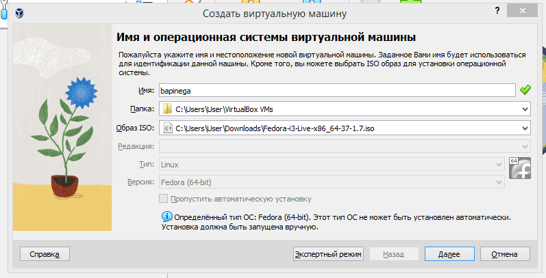
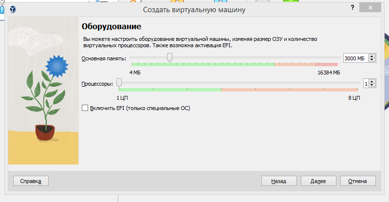
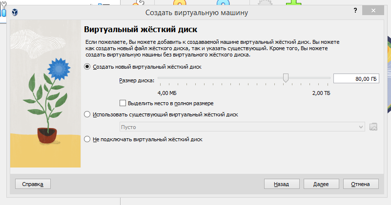
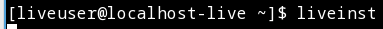
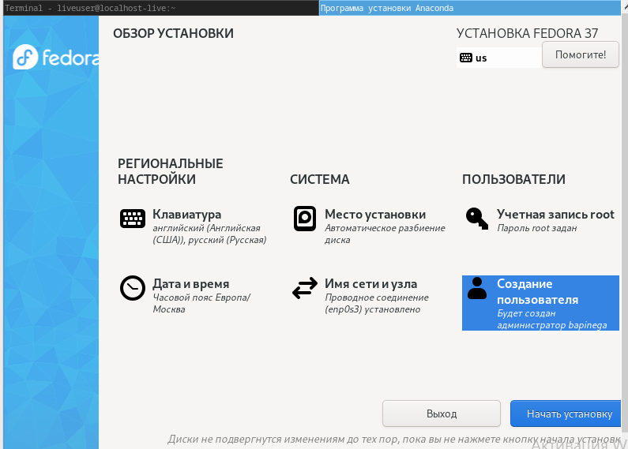
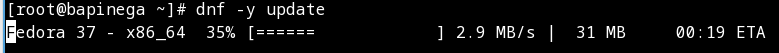
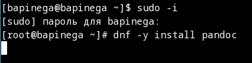
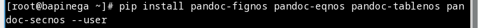
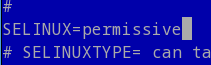
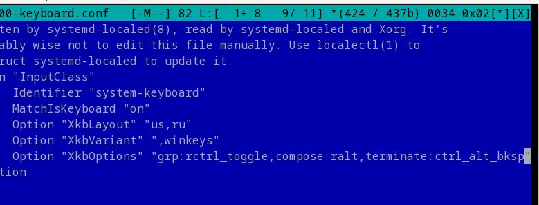

---
## Front matter
lang: ru-RU
title: Лабораторная работа 1 
subtitle: Установка опреационной системы на ВиртуалБокс
author:
  - Пинега Б.А.
institute:
  - Российский университет дружбы народов, Москва, Россия

## i18n babel
babel-lang: russian
babel-otherlangs: english

## Formatting pdf
toc: false
toc-title: Содержание
slide_level: 2
aspectratio: 169
section-titles: true
theme: metropolis
header-includes:
 - \metroset{progressbar=frametitle,sectionpage=progressbar,numbering=fraction}
 - '\makeatletter'
 - '\beamer@ignorenonframefalse'
 - '\makeatother'
---

# Информация

## Докладчик

:::::::::::::: {.columns align=center}
::: {.column width="70%"}

  * Пинега Белла Александровна
  * Студентка НБИбд-02-22
  * Российский университет дружбы народов

:::
::::::::::::::

## Цели и задачи

- Приобретение практических навыков установки операционной системы на виртуальную машину
- Настройки минимально необходимых для дальнейшей работы сервисов

## Необходимые параметры ОС
В менеджере Виртуал бокс я нажала кнопку "Создать" и задала имя своей ОС, выбрала нужный ISO-образ
{#fig:001 width=70%}

## Размер памяти 
{#fig:002 width=70%}

## Параметры жесткого диска
{#fig:003 width=70%}

## Установка ОС
Нажимаю enter, открываю терминал. Для установки системы ввожу команду liveinst
{#fig:005 width=40%}
Заполняю необходимые параметры, устанавливаю
{#fig:006 width=40%}

## Загрузка обновлений
Захожу в ОС, открываю терминал. Переключаюсь на роль супер-пользователя, обновляю пакеты
{#fig:007 width=70%}

## Установка программ
{#fig:008 width=20%}
Установлю pandoc
{#fig:013 width=20%}
Установлю необходимые расширения и дистрибутив TeXlive:
{#fig:014 width=20%}

## Отключу SELinux.
Перехожу в необходимый файл, исправляю
{#fig:011 width=70%}

## Раскладка клавиатуры
Переключаюсь на роль супер-пользователя, редактирую конфигурационный файл
{#fig:012 width=70%}

## Вывод
Я приобрела практические навыки установки операционной системы на виртуальную машину, навыки настройки минимально необходимых для дальнейшей работы сервисов.

