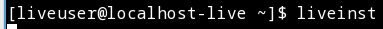

---
## Front matter
title: "Jтчёт по лабораторной работе №1"
subtitle: "Операционные системы"
author: "Пинега Белла Александровна"

## Generic otions
lang: ru-RU
toc-title: "Содержание"

## Bibliography
bibliography: bib/cite.bib
csl: pandoc/csl/gost-r-7-0-5-2008-numeric.csl

## Pdf output format
toc: true # Table of contents
toc-depth: 2
lof: true # List of figures
lot: true # List of tables
fontsize: 12pt
linestretch: 1.5
papersize: a4
documentclass: scrreprt
## I18n polyglossia
polyglossia-lang:
  name: russian
  options:
	- spelling=modern
	- babelshorthands=true
polyglossia-otherlangs:
  name: english
## I18n babel
babel-lang: russian
babel-otherlangs: english
## Fonts
mainfont: PT Serif
romanfont: PT Serif
sansfont: PT Sans
monofont: PT Mono
mainfontoptions: Ligatures=TeX
romanfontoptions: Ligatures=TeX
sansfontoptions: Ligatures=TeX,Scale=MatchLowercase
monofontoptions: Scale=MatchLowercase,Scale=0.9
## Biblatex
biblatex: true
biblio-style: "gost-numeric"
biblatexoptions:
  - parentracker=true
  - backend=biber
  - hyperref=auto
  - language=auto
  - autolang=other*
  - citestyle=gost-numeric
## Pandoc-crossref LaTeX customization
figureTitle: "Рис."
tableTitle: "Таблица"
listingTitle: "Листинг"
lofTitle: "Список иллюстраций"
lotTitle: "Список таблиц"
lolTitle: "Листинги"
## Misc options
indent: true
header-includes:
  - \usepackage{indentfirst}
  - \usepackage{float} # keep figures where there are in the text
  - \floatplacement{figure}{H} # keep figures where there are in the text
---

# Цель работы
Целью данной работы является приобретение практических навыков установки операционной системы на виртуальную машину, настройки минимально необходимых для дальнейшей работы сервисов.

# Задание

    Создание виртуальной машины
    Установка операционной системы
    Загрузка обновлений
    Настройка раскладки клавиатуры
    Установка программного обеспечения для создания документации
    Домашнее задание

# Теоретическое введение

| Имя каталога | Описание каталога                                                                                                          |
|--------------|----------------------------------------------------------------------------------------------------------------------------|
| `/`          | Корневая директория, содержащая всю файловую                                                                               |
| `/bin `      | Основные системные утилиты, необходимые как в однопользовательском режиме, так и при обычной работе всем пользователям     |
| `/etc`       | Общесистемные конфигурационные файлы и файлы конфигурации установленных программ                                           |
| `/home`      | Содержит домашние директории пользователей, которые, в свою очередь, содержат персональные настройки и данные пользователя |
| `/media`     | Точки монтирования для сменных носителей                                                                                   |
| `/root`      | Домашняя директория пользователя  `root`                                                                                   |
| `/tmp`       | Временные файлы                                                                                                            |
| `/usr`       | Вторичная иерархия для данных пользователя                                                                                 |

Более подробно об Unix см. в [@gnu-doc:bash;@newham:2005:bash;@zarrelli:2017:bash;@robbins:2013:bash;@tannenbaum:arch-pc:ru;@tannenbaum:modern-os:ru].

# Выполнение лабораторной работы
1. Предварительно я установила на свое устройство VirtualBox и дистрибутив Fedora. Затем в открывшемся менеджере Виртуал бокс я нажала кнопку "Создать" и задала имя своей ОС в соответствие с логином и выбрала нужный ISO-образ:
{#fig:001 width=70%}
2. Размер памяти указываю 3000 мб:
{#fig:002 width=70%}
3. Выбираю создать новый жесткий диск, выбраю размер его памяти 80 гб:
{#fig:003 width=70%}
4. Виртуальная ОС создана, запускаем:
{#fig:004 width=70%}
5. Нажимаю enter 3 раза(по ходу установки), с помощью команды Win+Enter открываю терминал. Для установки системы ввожу команду liveinst:
{#fig:005 width=70%}
6. Заполняю необходимые параметры, нажимаю установить:
{#fig:006 width=70%}
7. Захожу в ОС, с помощью команды Win+Enter открываю терминал. Переключаюсь на роль супер-пользователя командой sudo -i, при помощи команды dnf -y update обновляю пакеты:
{#fig:007 width=70%}
8. Устанавливаю программы для удобства работы в консоли:
{#fig:008 width=70%}
9. Устанавливаю ПО:
{#fig:009 width=70%}
10. Запускаю таймер:
{#fig:010 width=70%}
11. Далее отключу SELinux. С помощью mc перехожу в необходимый файл, нажимаю править и справляю:
{#fig:011 width=70%}
12. Настрою раскладку клавиатуры. С помощью команды Win+Enter открываю терминал. Переключаюсь на роль супер-пользователя командой sudo -i, редактирую конфигурационный файл:
{#fig:012 width=70%}
Перезапускаю командой reboot.
13. С помощью команды Win+Enter открываю терминал. Переключаюсь на роль супер-пользователя командой sudo -i, установлю pandoc:
{#fig:013 width=70%}
14. Установлю необходимые расширения и дистрибутив TeXlive:
{#fig:014 width=70%}
15. Домашнее задание:
{#fig:015 width=70%} 
{#fig:016 width=70%}
{#fig:017 width=70%}
{#fig:018 width=70%}
{#fig:019 width=70%}
{#fig:020 width=70%}
{#fig:021 width=70%}
# Выводы

Я научилась устанавливать операционную систему на вирутальную машину, настраивать минимально необходимые для дальнейшей работы сервисы.

# Список литературы{.unnumbered}

::: {#refs}
:::
