---
## Front matter
lang: ru-RU
title: Лабораторная работа 4
subtitle: Операционные системы
author:
  - Пинега Б.А.
institute:
  - Российский университет дружбы народов, Москва, Россия

## i18n babel
babel-lang: russian
babel-otherlangs: english

## Formatting pdf
toc: false
toc-title: Содержание
slide_level: 2
aspectratio: 169
section-titles: true
theme: metropolis
header-includes:
 - \metroset{progressbar=frametitle,sectionpage=progressbar,numbering=fraction}
 - '\makeatletter'
 - '\beamer@ignorenonframefalse'
 - '\makeatother'
---

# Информация

## Докладчик

:::::::::::::: {.columns align=center}
::: {.column width="70%"}

  * Пинега Белла Александровна
  * Студентка НБИбд-02-22
  * Российский университет дружбы народов

:::
::::::::::::::

## Цель

Приобретение практических навыков взаимодействия пользователя с системой по-
средством командной строки.

:::
## Задание 1 
Определяю полное имя моего домашнего каталога
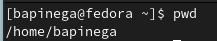{#fig:001 width=70%}

## Задание 2
Содержимое каталога /tmp:
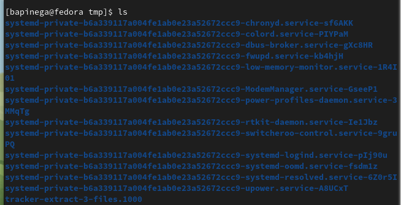{#fig:002 width=40%}
Затем применяю опцию -а и другие (t, l)
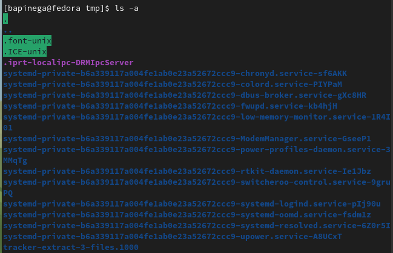{#fig:003 width=40%}

## Задание 2
Вывожу на экран содержимое домашнего каталога и определяю владельца
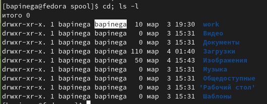{#fig:007 width=70%}

## Задание 3
В домашнем каталоге создаю новый каталог с именем newdir, а в каталоге ~/newdir создаю новый каталог с именем morefun:
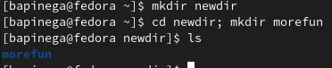{#fig:008 width=70%}

## Задание 3
В домашнем каталоге создам одной командой три новых каталога с именами
letters, memos, misk. Затем удалю их:
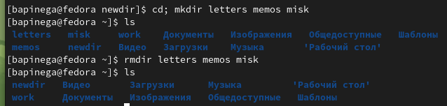{#fig:009 width=70%}

## Задание 3
Удалю каталог ~/newdir/morefun из домашнего каталога:
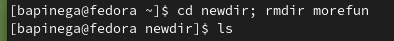{#fig:010 width=70%}

## Задание 4
Нужно использовать опции -t для сортировки по времени:
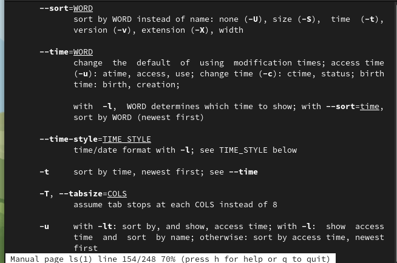{#fig:012 width=70%}

## Задание 6
Команды используются для 
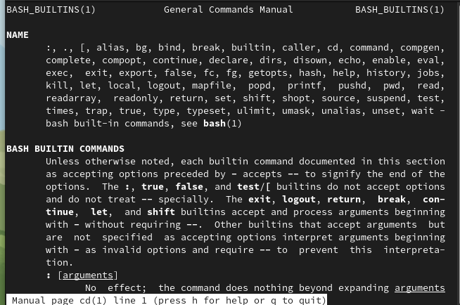{#fig:013 width=15%}
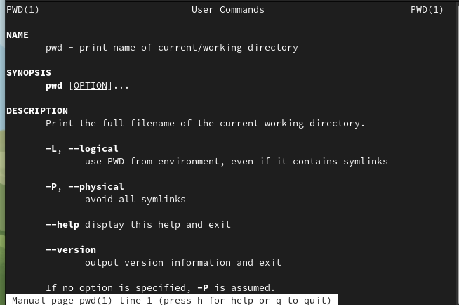{#fig:014 width=15%}
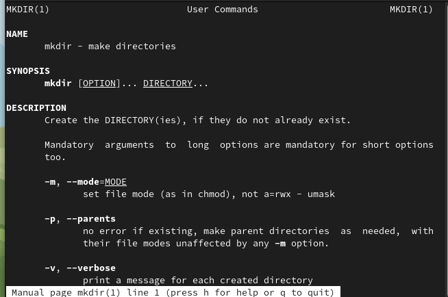{#fig:015 width=15%} 
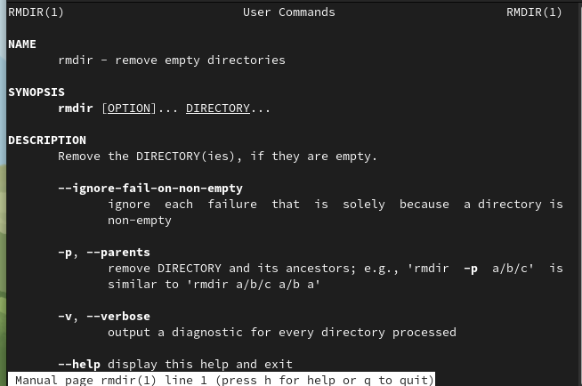{#fig:016 width=15%}
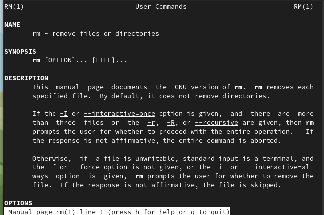{#fig:017 width=15%}

## Задание 7
При помощи команды history, выполню модификацию и исполнение нескольких команд:
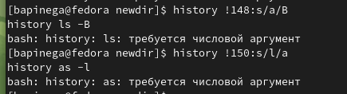{#fig:018 width=70%}

## Вывод

Я приобрела практические навыки взаимодействия пользователя с системой по-
средством командной строки.

::: 

