---
## Front matter
lang: ru-RU
title: Лабораторная работа 4
subtitle: Операционные системы
author:
  - Пинега Б.А.
institute:
  - Российский университет дружбы народов, Москва, Россия

## i18n babel
babel-lang: russian
babel-otherlangs: english

## Formatting pdf
toc: false
toc-title: Содержание
slide_level: 2
aspectratio: 169
section-titles: true
theme: metropolis
header-includes:
 - \metroset{progressbar=frametitle,sectionpage=progressbar,numbering=fraction}
 - '\makeatletter'
 - '\beamer@ignorenonframefalse'
 - '\makeatother'
---

# Информация

## Докладчик

:::::::::::::: {.columns align=center}
::: {.column width="70%"}

  * Пинега Белла Александровна
  * Студентка НБИбд-02-22
  * Российский университет дружбы народов

:::
::::::::::::::

## Цель

Познакомиться  с файловой системой Linux, её структурой, именами и содержанием каталогов. Приобреcти практические навыки по применению команд для работы с файлами и каталогами, по управлению процессами (и работами), по проверке использования диска и обслуживанию файловой системы.

:::
## копирование файла

Скопирую файл kd.h и назову его equipment
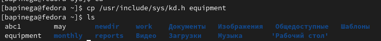{#fig:003 width=70%}

## перемещение файла

Перемещаю файл equipment в каталог ~/ski.plases.
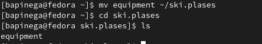{#fig:005 width=70%}

## переименовка файла

Переименую файл ~/ski.plases/equipment в ~/ski.plases/equiplist
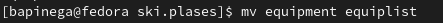{#fig:006 width=70%}

## создание файла

Создаю в домашнем каталоге файл abc1 и скопирую его в каталог
~/ski.plases, назову его equiplist2:
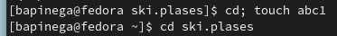{#fig:007 width=45%}
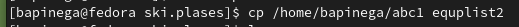{#fig:008 width=45%}

## опции команды chmod

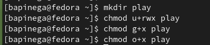{#fig:013 width=70%

## опции команды chmod

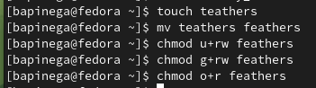{#fig:015 width=70%} 

## копирование каталога

Скопирую каталог ~/play в каталог ~/fun:
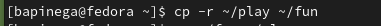{#fig:018 width=70%}

## Задание 4

Лишаю владельца файла ~/feathers права на чтение.
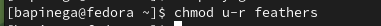{#fig:021 width=45%}

Я пробую просмотреть файл ~/feathers командой
cat:
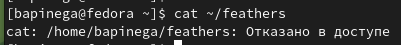{#fig:022 width=45%}
Файл не открылся. Отказано в доступе.

## Задание 4

Я попыталась скопировать файл ~/feathers:
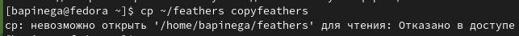{#fig:023 width=70%}
Файл не скопировался. Отказано в доступе.

## Задание 4

Лишаю владельца каталога ~/play права на выполнение:
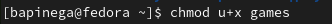{#fig:025 width=20%}

Перехожу в каталог ~/play:
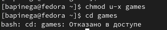{#fig:026 width=20%}
Отказано в доступе.

Возвращаю владельцу каталога ~/play право на выполнение:
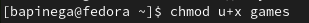{#fig:027 width=20%}

## man по командам 

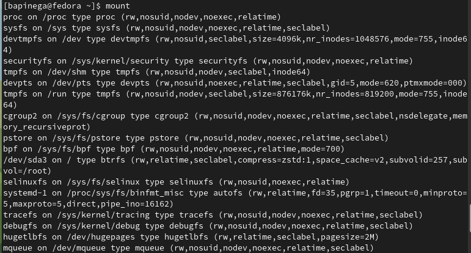{#fig:029 width=45%}
Для просмотра используемых в операционной системе файловых систем можно вос-
пользоваться командой mount без параметров.

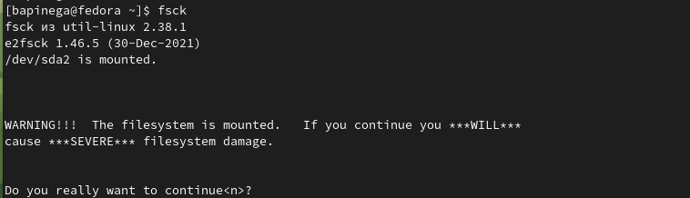{#fig:031 width=45%} 
С помощью команды fsck можно проверить (а в ряде случаев восстановить) целост-
ность файловой системы

## man по командам 

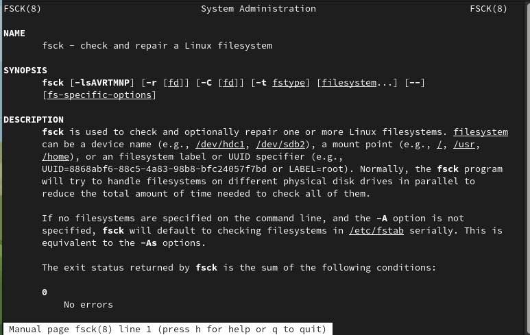{#fig:030 width=70%}
С помощью команды mkfs создаются файлы.

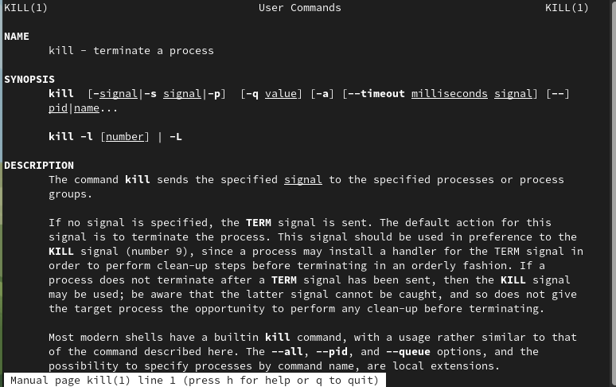{#fig:033 width=70%}
С помощью команды kill подается указаный сигнал указанному процессу.

# Вывод

Я познакомилась  с файловой системой Linux, её структурой, именами и содержанием каталогов. Приобрела практические навыки по применению команд для работы с файлами и каталогами, по управлению процессами (и работами), по проверке использования диска и обслуживанию файловой системы.

::: 

