---
## Front matter
title: "Лабораторная работа №5"
subtitle: "Операционные системы"
author: "Пинега Белла Александровна"

## Generic otions
lang: ru-RU
toc-title: "Содержание"

## Bibliography
bibliography: bib/cite.bib
csl: pandoc/csl/gost-r-7-0-5-2008-numeric.csl

## Pdf output format
toc: true # Table of contents
toc-depth: 2
lof: true # List of figures
lot: true # List of tables
fontsize: 12pt
linestretch: 1.5
papersize: a4
documentclass: scrreprt
## I18n polyglossia
polyglossia-lang:
  name: russian
  options:
	- spelling=modern
	- babelshorthands=true
polyglossia-otherlangs:
  name: english
## I18n babel
babel-lang: russian
babel-otherlangs: english
## Fonts
mainfont: PT Serif
romanfont: PT Serif
sansfont: PT Sans
monofont: PT Mono
mainfontoptions: Ligatures=TeX
romanfontoptions: Ligatures=TeX
sansfontoptions: Ligatures=TeX,Scale=MatchLowercase
monofontoptions: Scale=MatchLowercase,Scale=0.9
## Biblatex
biblatex: true
biblio-style: "gost-numeric"
biblatexoptions:
  - parentracker=true
  - backend=biber
  - hyperref=auto
  - language=auto
  - autolang=other*
  - citestyle=gost-numeric
## Pandoc-crossref LaTeX customization
figureTitle: "Рис."
tableTitle: "Таблица"
listingTitle: "Листинг"
lofTitle: "Список иллюстраций"
lotTitle: "Список таблиц"
lolTitle: "Листинги"
## Misc options
indent: true
header-includes:
  - \usepackage{indentfirst}
  - \usepackage{float} # keep figures where there are in the text
  - \floatplacement{figure}{H} # keep figures where there are in the text
---

# Цель работы

Познакомиться с файловой системой Linux, её структурой, именами и содержанием
каталогов. Приобретести практические навыки по применению команд для работы
с файлами и каталогами, по управлению процессами (и работами), по проверке использования диска и обслуживанию файловой системы.

# Задание

1. Выполните все примеры, приведённые в первой части описания лабораторной работы.
2. Выполните следующие действия, зафиксировав в отчёте по лабораторной работе
используемые при этом команды и результаты их выполнения:
2.1. Скопируйте файл /usr/include/sys/io.h в домашний каталог и назовите его
equipment. Если файла io.h нет, то используйте любой другой файл в каталоге
/usr/include/sys/ вместо него.
2.2. В домашнем каталоге создайте директорию ~/ski.plases.
2.3. Переместите файл equipment в каталог ~/ski.plases.
2.4. Переименуйте файл ~/ski.plases/equipment в ~/ski.plases/equiplist.
2.5. Создайте в домашнем каталоге файл abc1 и скопируйте его в каталог
~/ski.plases, назовите его equiplist2.
2.6. Создайте каталог с именем equipment в каталоге ~/ski.plases.
2.7. Переместите файлы ~/ski.plases/equiplist и equiplist2 в каталог
~/ski.plases/equipment.
2.8. Создайте и переместите каталог ~/newdir в каталог ~/ski.plases и назовите
его plans
Кулябов Д. С. и др. Операционные системы 53
3. Определите опции команды chmod, необходимые для того, чтобы присвоить перечис-
ленным ниже файлам выделенные права доступа, считая, что в начале таких прав
нет:
3.1. drwxr--r-- ... australia
3.2. drwx--x--x ... play
3.3. -r-xr--r-- ... my_os
3.4. -rw-rw-r-- ... feathers
При необходимости создайте нужные файлы.
4. Проделайте приведённые ниже упражнения, записывая в отчёт по лабораторной
работе используемые при этом команды:
4.1. Просмотрите содержимое файла /etc/password.
4.2. Скопируйте файл ~/feathers в файл ~/file.old.
4.3. Переместите файл ~/file.old в каталог ~/play.
4.4. Скопируйте каталог ~/play в каталог ~/fun.
4.5. Переместите каталог ~/fun в каталог ~/play и назовите его games.
4.6. Лишите владельца файла ~/feathers права на чтение.
4.7. Что произойдёт, если вы попытаетесь просмотреть файл ~/feathers командой
cat?
4.8. Что произойдёт, если вы попытаетесь скопировать файл ~/feathers?
4.9. Дайте владельцу файла ~/feathers право на чтение.
4.10. Лишите владельца каталога ~/play права на выполнение.
4.11. Перейдите в каталог ~/play. Что произошло?
4.12. Дайте владельцу каталога ~/play право на выполнение.
5. Прочитайте man по командам mount, fsck, mkfs, kill и кратко их охарактеризуйте,
приведя примеры.

# Теоретическое введение

Для создания текстового файла можно использовать команду touch.
Формат команды:
1 touch имя-файла
Для просмотра файлов небольшого размера можно использовать команду cat.
Формат команды:
1 cat имя-файла
Для просмотра файлов постранично удобнее использовать команду less.
Формат команды:
1 less имя-файла
Следующие клавиши используются для управления процессом просмотра:
– Space — переход к следующей странице,
– ENTER — сдвиг вперёд на одну строку,
– b — возврат на предыдущую страницу,
– h — обращение за подсказкой,
– q — выход из режима просмотра файла.
Команда head выводит по умолчанию первые 10 строк файла.
Формат команды:
1 head [-n] имя-файла,
где n — количество выводимых строк.
Команда tail выводит умолчанию 10 последних строк файла.
Формат команды:
1 tail [-n] имя-файла,

# Выполнение лабораторной работы
1. Выполняю все примеры, приведённые в первой части описания лабораторной работы:
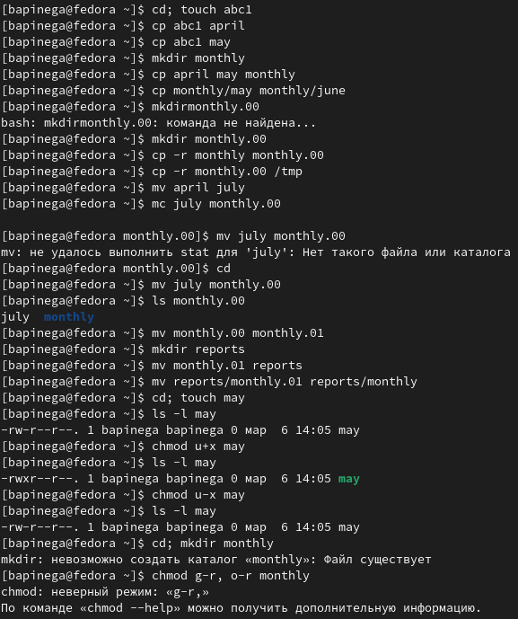{#fig:001 width=70%}
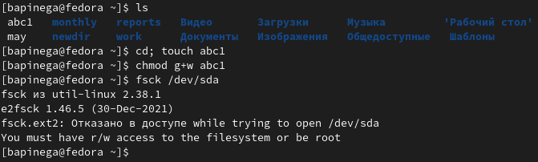{#fig:002 width=70%}
2. Скопирую файл /usr/include/sys/kd.h в домашний каталог и назову его
equipment. 
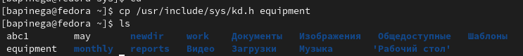{#fig:003 width=70%}
3. В домашнем каталоге создам директорию ~/ski.plases:
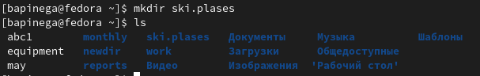{#fig:004 width=70%}
4. Перемещаю файл equipment в каталог ~/ski.plases.
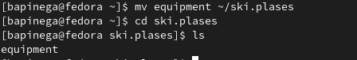{#fig:005 width=70%}
5. Переименую файл ~/ski.plases/equipment в ~/ski.plases/equiplist
{#fig:006 width=70%}
6. Создаю в домашнем каталоге файл abc1 и скопирую его в каталог
~/ski.plases, назову его equiplist2:
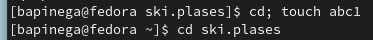{#fig:007 width=70%}
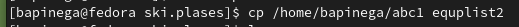{#fig:008 width=70%}
7. Создаю каталог с именем equipment в каталоге ~/ski.plases:
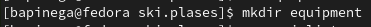{#fig:009 width=70%}
8. Перемещу файлы ~/ski.plases/equiplist и equiplist2 в каталог
~/ski.plases/equipment:
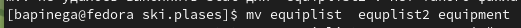{#fig:010 width=70%}
9. Создам и перемещу каталог ~/newdir в каталог ~/ski.plases и назову
его plans:
{#fig:011 width=70%}
10. Определю опции команды chmod, необходимые для того, чтобы присвоить перечисленным ниже файлам выделенные права доступа, считая, что в начале таких прав нет:
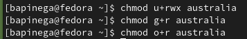{#fig:012 width=70%}
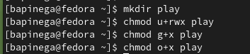{#fig:013 width=70%}
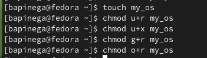{#fig:014 width=70%}
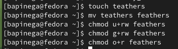{#fig:015 width=70%} 
11. Скопирую файл ~/feathers в файл ~/file.old:
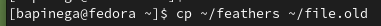{#fig:016 width=70%}
12. Перемещу файл ~/file.old в каталог ~/play:
{#fig:017 width=70%}
13. Скопирую каталог ~/play в каталог ~/fun:
{#fig:018 width=70%}
14. Перемещу каталог ~/fun в каталог ~/play и назову его games:
{#fig:019 width=70%}
{#fig:020 width=70%}
15. Лишаю владельца файла ~/feathers права на чтение.
{#fig:021 width=70%}
16. Я пробую просмотреть файл ~/feathers командой
cat:
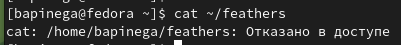{#fig:022 width=70%}
Файл не открылся. Отказано в доступе.
17. Я попыталась скопировать файл ~/feathers:
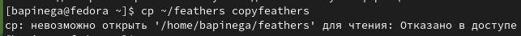{#fig:023 width=70%}
Файл не скопировался. Отказано в доступе.
18. Дам владельцу файла ~/feathers право на чтение:
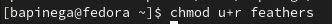{#fig:024 width=70%}
19. Лишаю владельца каталога ~/play права на выполнение:
{#fig:025 width=70%}
20. Перехожу в каталог ~/play:
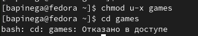{#fig:026 width=70%}
Отказано в доступе.
21. Возвращаю владельцу каталога ~/play право на выполнение:
{#fig:027 width=70%}
22. Прочитаю man по командам и кратко их охарактеризую,
приведя примеры:
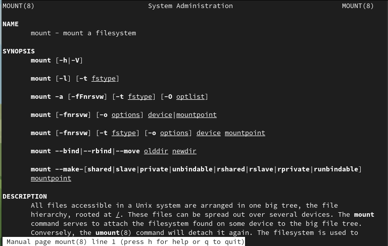{#fig:028 width=70%}
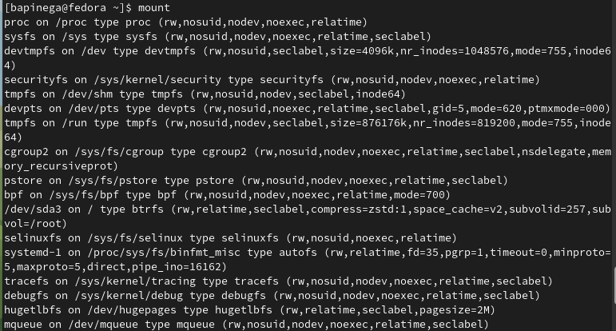{#fig:029 width=70%}
Для просмотра используемых в операционной системе файловых систем можно вос-
пользоваться командой mount без параметров.

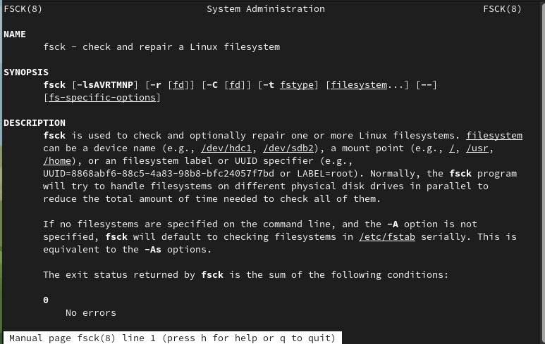{#fig:030 width=70%}
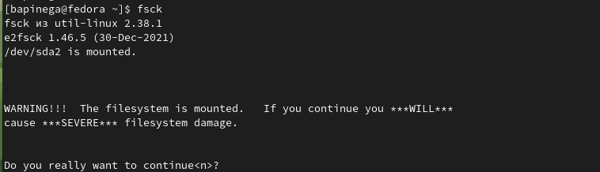{#fig:031 width=70%} 
С помощью команды fsck можно проверить (а в ряде случаев восстановить) целост-
ность файловой системы

{#fig:030 width=70%}
С помощью команды mkfs создаются файлы.

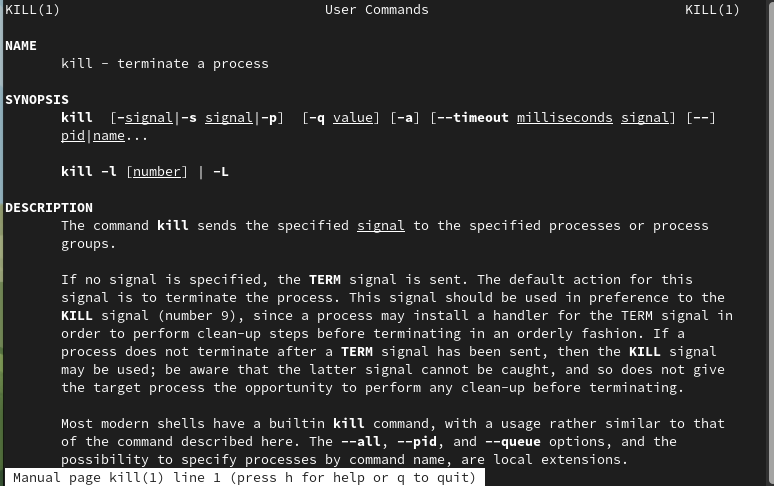{#fig:033 width=70%}
С помощью команды kill подается указаный сигнал указанному процессу.

# Выводы

Я познакомилась  с файловой системой Linux, её структурой, именами и содержанием каталогов. Приобрела практические навыки по применению команд для работы с файлами и каталогами, по управлению процессами (и работами), по проверке использования диска и обслуживанию файловой системы.

# Список литературы{.unnumbered}

::: {#refs}
:::
