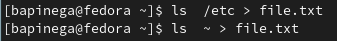
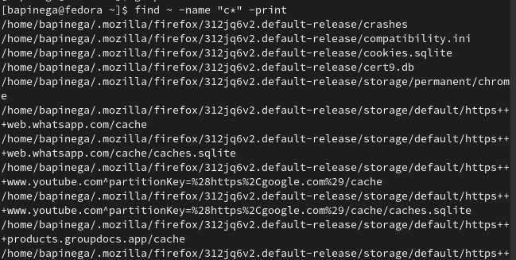
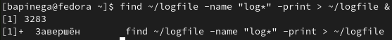
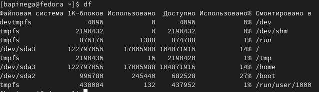

---
## Front matter
lang: ru-RU
title: Лабораторная работа 6
subtitle: Операционные системы
author:
  - Пинега Б.А.
institute:
  - Российский университет дружбы народов, Москва, Россия

## i18n babel
babel-lang: russian
babel-otherlangs: english

## Formatting pdf
toc: false
toc-title: Содержание
slide_level: 2
aspectratio: 169
section-titles: true
theme: metropolis
header-includes:
 - \metroset{progressbar=frametitle,sectionpage=progressbar,numbering=fraction}
 - '\makeatletter'
 - '\beamer@ignorenonframefalse'
 - '\makeatother'
---

# Информация

## Докладчик

:::::::::::::: {.columns align=center}
::: {.column width="70%"}

  * Пинега Белла Александровна
  * Студентка НБИбд-02-22
  * Российский университет дружбы народов

:::
::::::::::::::

## Цель работы

Ознакомление с инструментами поиска файлов и фильтрации текстовых данных.
Приобретение практических навыков: по управлению процессами (и заданиями), по
проверке использования диска и обслуживанию файловых систем.

## Задание 2
Записала в файл file.txt названия файлов, содержащихся в каталоге /etc и то же сделала с файлами ~
{#fig:001 width=70%}
## Задание 3
Вывожу имена всех файлов из file.txt, имеющих расширение .conf, после чего
запишу их в новый текстовой файл conf.txt
{#fig:002 width=70%}
## Задание 4
{#fig:003 width=90%}
## Задание 6
Запустила в фоновом режиме процесс, который будет записывать в файл ~/logfile
файлы, имена которых начинаются с log
{#fig:005 width=70%}
## Задание 7
Запущу в фоновом режиме редактор gedit
{#fig:007 width=70%}
## Задание 8
Команды kill для завершения процесса gedit:
{#fig:012 width=70%}
## Задание 9
Выполню команды df и du:
{#fig:015 width=40%}
{#fig:016 width=40%}

## Выводы

Я ознакомилась с инструментами поиска файлов и фильтрации текстовых данных.Научилась управлять процессами (и заданиями), по проверке использования диска и обслуживанию файловых систем.

