---
## Front matter
lang: ru-RU
title: Лабораторная работа 1 
subtitle: Установка опреационной системы на ВиртуалБокс
author:
  - Пинега Б.А.
institute:
  - Российский университет дружбы народов, Москва, Россия

## i18n babel
babel-lang: russian
babel-otherlangs: english

## Formatting pdf
toc: false
toc-title: Содержание
slide_level: 2
aspectratio: 169
section-titles: true
theme: metropolis
header-includes:
 - \metroset{progressbar=frametitle,sectionpage=progressbar,numbering=fraction}
 - '\makeatletter'
 - '\beamer@ignorenonframefalse'
 - '\makeatother'
---

# Информация

## Докладчик

:::::::::::::: {.columns align=center}
::: {.column width="70%"}

  * Пинега Белла Александровна
  * Студентка НБИбд-02-22
  * Российский университет дружбы народов

:::
::::::::::::::

## Цель работы
Освоение основных возможностей командной оболочки Midnight Commander. Приоб-
ретение навыков практической работы по просмотру каталогов и файлов; манипуляций
с ними.

## mc, его структура
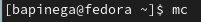{#fig:004 width=45%}
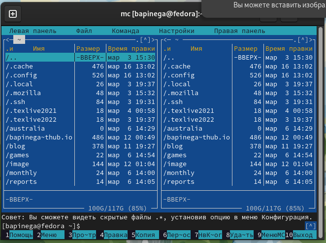{#fig:005 width=45%}

## выделение/отмена выделения файлов
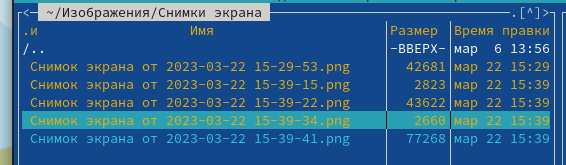{#fig:006 width=70%}

## копирование/перемещение файлов
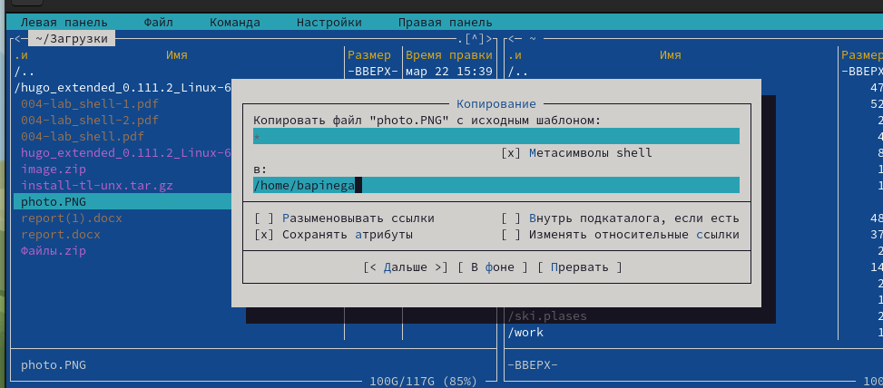{#fig:008 width=70%}
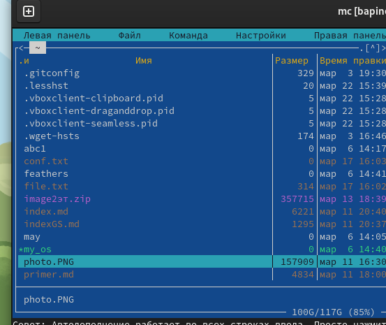{#fig:009 width=70%}
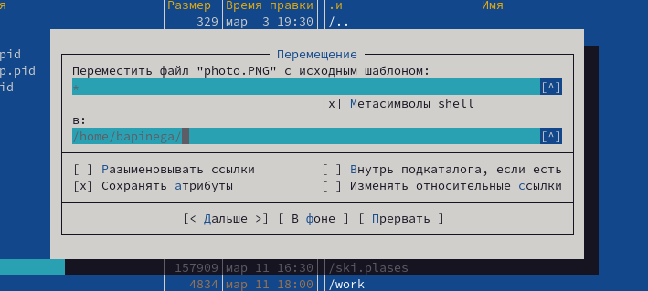{#fig:010 width=70%}

## информацию о размере и правах доступа 
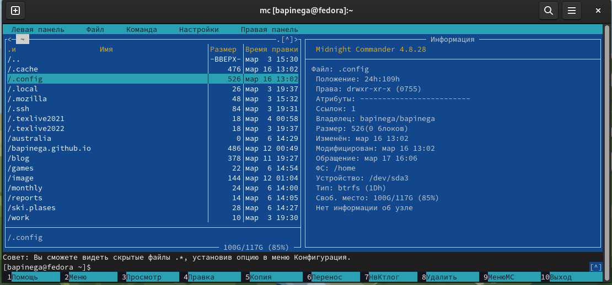{#fig:011 width=70%}

## возможности подменю Файл 
Используя возможности подменю Файл просмотрю содержимое текстового файла:
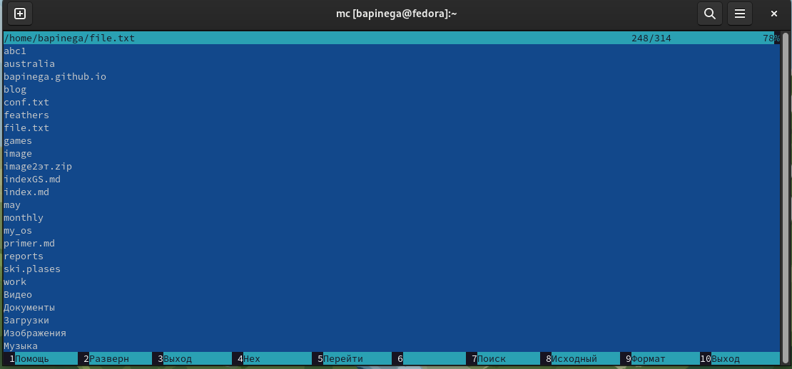{#fig:012 width=70%}

## возможности подменю Файл 
Используя возможности подменю Файл редактирую содержимое текстового файла
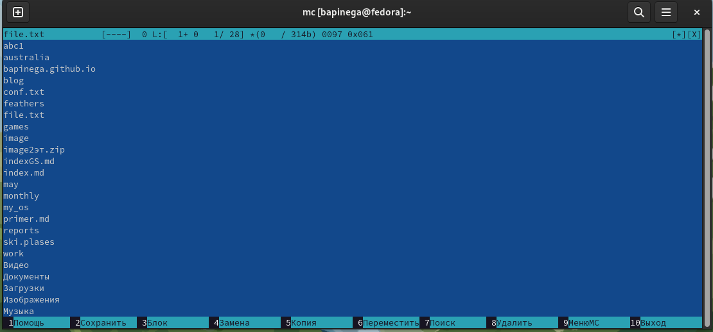{#fig:013 width=70%}

## возможности подменю Файл 
Используя возможности подменю Файл создам каталог
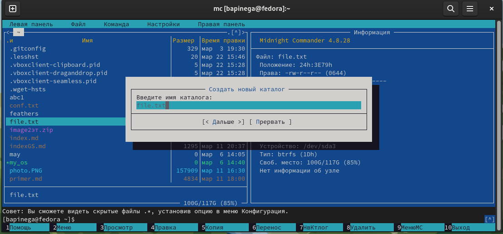{#fig:014 width=70%}

## возможности подменю Команда 
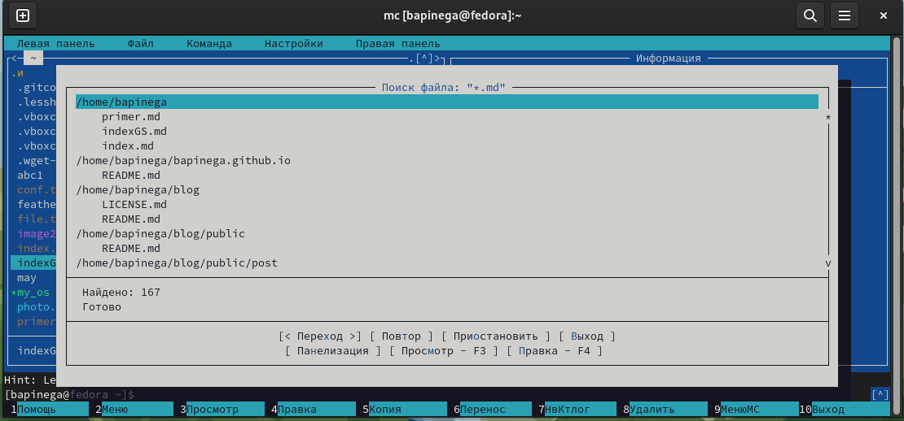{#fig:015 width=70%} 

## возможности подменю Команда 
С помощью соответствующих средств подменю Команда осуществлю выбор и повторение одной из предыдущих команд:
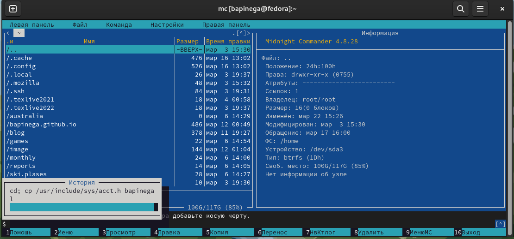{#fig:016 width=70%}

## возможности подменю Настройки
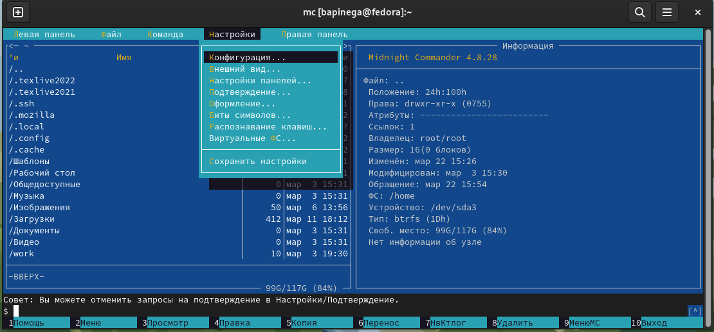{#fig:018 width=30%}
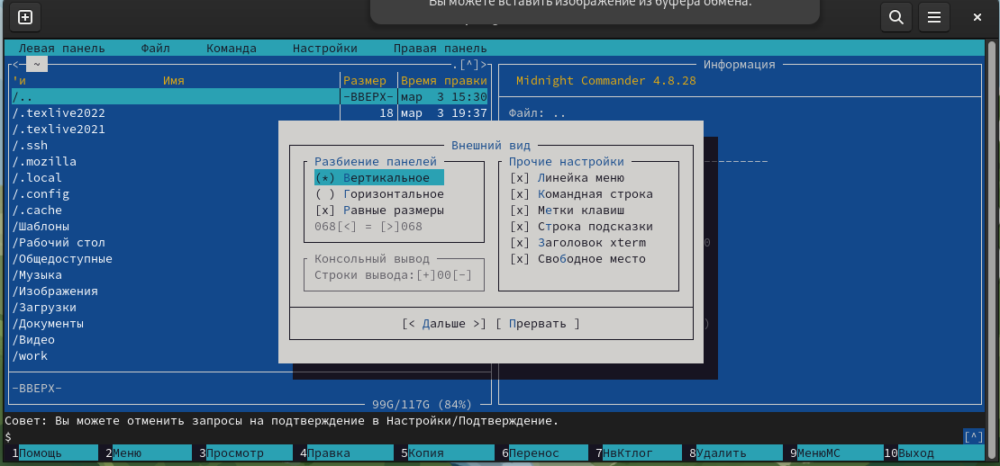{#fig:019 width=30%}
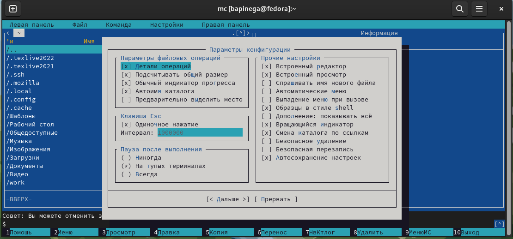{#fig:020 width=30%}

## возможности редактора mc
Открою  файл с помощью встроенного в mc редактора и вставлю в открытый файл небольшой фрагмент текста, скопированный из Интернета
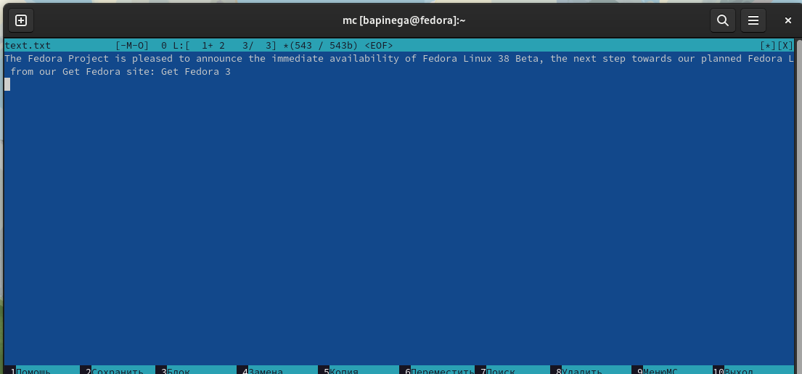{#fig:022 width=70%}

## возможности редактора mc
 Удалю строку текста, используя горячие клавиши
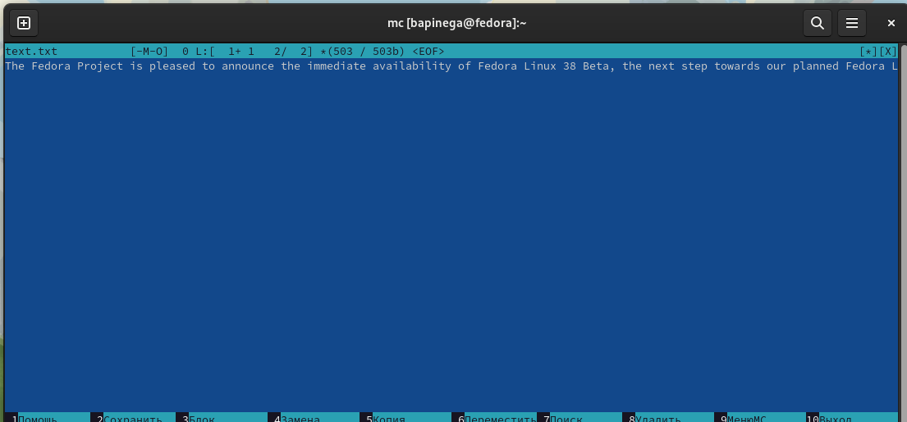{#fig:023 width=70%}

## возможности редактора mc
 Выделю фрагмент текста и скопирую его на новую строку
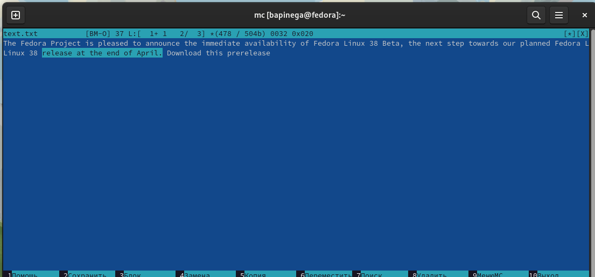{#fig:024 width=35%} 
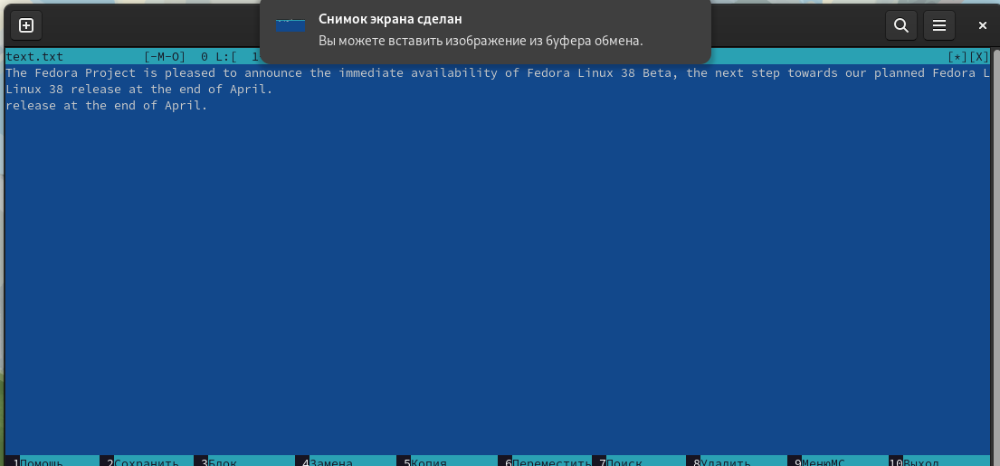{#fig:026 width=35%}

## возможности редактора mc
Открою файл с исходным текстом на некотором языке программирования. Используя меню редактора, включу подсветку синтаксиса:
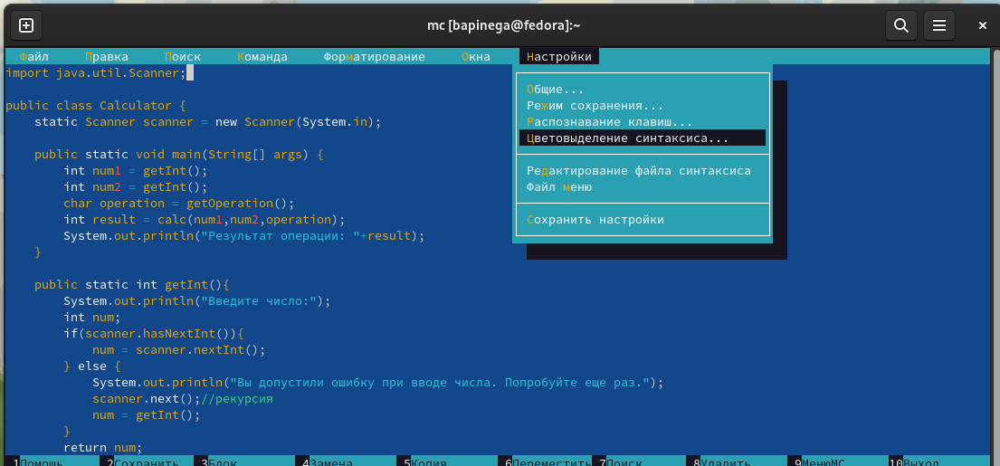{#fig:031 width=70%}

## Выводы

Я освоила основные возможности командной оболочки Midnight Commander. Приобрела навыки практической работы по просмотру каталогов и файлов; манипуляций с ними.
