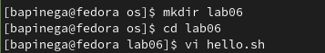
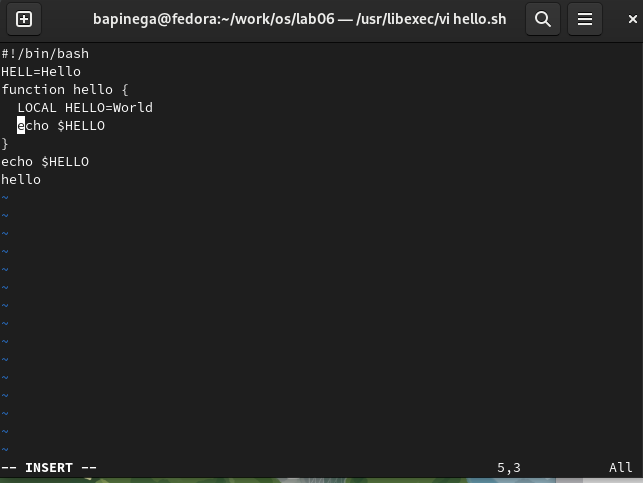
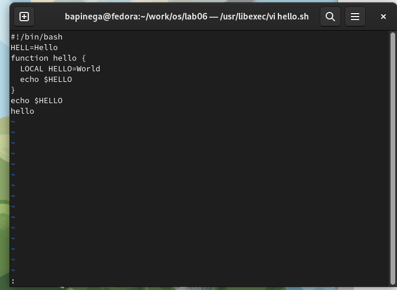
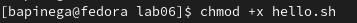
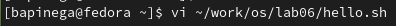
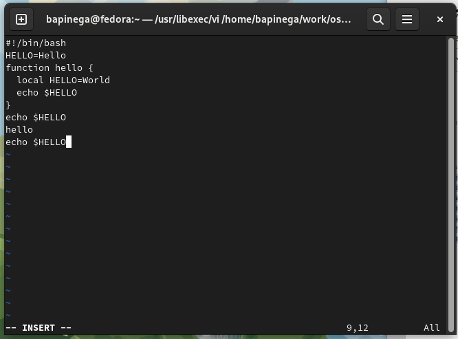
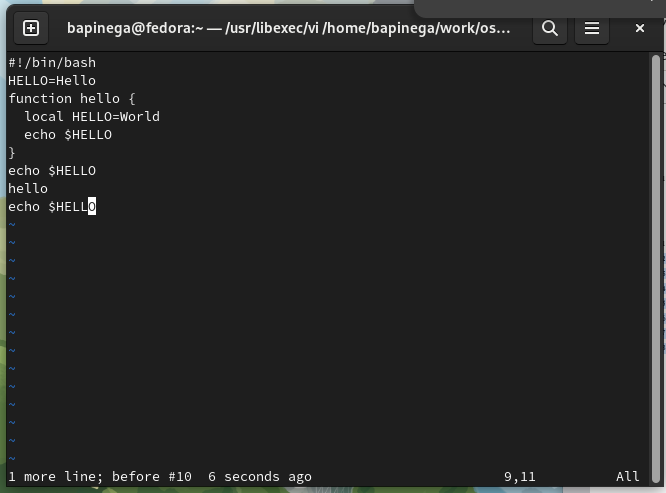

---
## Front matter
lang: ru-RU
title: Лабораторная работа 8
subtitle: Текстовой редактор vi
author:
  - Пинега Б.А.
institute:
  - Российский университет дружбы народов, Москва, Россия

## i18n babel
babel-lang: russian
babel-otherlangs: english

## Formatting pdf
toc: false
toc-title: Содержание
slide_level: 2
aspectratio: 169
section-titles: true
theme: metropolis
header-includes:
 - \metroset{progressbar=frametitle,sectionpage=progressbar,numbering=fraction}
 - '\makeatletter'
 - '\beamer@ignorenonframefalse'
 - '\makeatother'
---

# Информация

## Докладчик

:::::::::::::: {.columns align=center}
::: {.column width="70%"}

  * Пинега Белла Александровна
  * Студентка НБИбд-02-22
  * Российский университет дружбы народов

:::
::::::::::::::

## Цель работы

Познакомиться с операционной системой Linux. Получить практические навыки работы с редактором vi, установленным по умолчанию практически во всех дистрибутивах.

## Выполнение лабораторной работы
Вызываю vi и создаю файл hello.sh
{#fig:001 width=70%}

## Выполнение лабораторной работы
{#fig:003 width=70%}

## Выполнение лабораторной работы
Нажму клавишу Esc для перехода в командный режим после завершения ввода
текста. Нажму : для перехода в режим последней строки
{#fig:004 width=70%}
Нажму w и q, а затем нажму клавишу Enter для сохранения
текста и завершения работы.

## Выполнение лабораторной работы
Сделаю файл исполняемым
{#fig:005 width=70%}

## Редактирование файла
Вызову vi на редактирование файла:
{#fig:006 width=70%}

## Ввожу заданный текст
{#fig:011 width=70%}

## Команда u
Удалю последнюю строку. ВВеду команду отмены изменений u для отмены последней команды:
{#fig:013 width=70%}

## Выводы

Я познакомилась с операционной системой Linux. Получила практические навыки работы с редактором vi, установленным по умолчанию практически во всех дистрибутивах.
