---
## Front matter
title: "Лабораторная работа №8"
subtitle: "Операционные системы"
author: "Пинега Белла Александровна"

## Generic otions
lang: ru-RU
toc-title: "Содержание"

## Bibliography
bibliography: bib/cite.bib
csl: pandoc/csl/gost-r-7-0-5-2008-numeric.csl

## Pdf output format
toc: true # Table of contents
toc-depth: 2
lof: true # List of figures
lot: true # List of tables
fontsize: 12pt
linestretch: 1.5
papersize: a4
documentclass: scrreprt
## I18n polyglossia
polyglossia-lang:
  name: russian
  options:
	- spelling=modern
	- babelshorthands=true
polyglossia-otherlangs:
  name: english
## I18n babel
babel-lang: russian
babel-otherlangs: english
## Fonts
mainfont: PT Serif
romanfont: PT Serif
sansfont: PT Sans
monofont: PT Mono
mainfontoptions: Ligatures=TeX
romanfontoptions: Ligatures=TeX
sansfontoptions: Ligatures=TeX,Scale=MatchLowercase
monofontoptions: Scale=MatchLowercase,Scale=0.9
## Biblatex
biblatex: true
biblio-style: "gost-numeric"
biblatexoptions:
  - parentracker=true
  - backend=biber
  - hyperref=auto
  - language=auto
  - autolang=other*
  - citestyle=gost-numeric
## Pandoc-crossref LaTeX customization
figureTitle: "Рис."
tableTitle: "Таблица"
listingTitle: "Листинг"
lofTitle: "Список иллюстраций"
lotTitle: "Список таблиц"
lolTitle: "Листинги"
## Misc options
indent: true
header-includes:
  - \usepackage{indentfirst}
  - \usepackage{float} # keep figures where there are in the text
  - \floatplacement{figure}{H} # keep figures where there are in the text
---

# Цель работы

Познакомиться с операционной системой Linux. Получить практические навыки работы с редактором vi, установленным по умолчанию практически во всех дистрибутивах.

# Задание

1. Ознакомиться с теоретическим материалом.
2. Ознакомиться с редактором vi.
3. Выполнить упражнения, используя команды vi.

# Теоретическое введение

В большинстве дистрибутивов Linux в качестве текстового редактора по умолчанию
устанавливается интерактивный экранный редактор vi (Visual display editor).
Редактор vi имеет три режима работы:
– командный режим — предназначен для ввода команд редактирования и навигации по
редактируемому файлу;
– режим вставки — предназначен для ввода содержания редактируемого файла;
– режим последней (или командной) строки — используется для записи изменений в файл
и выхода из редактора.
Для вызова редактора vi необходимо указать команду vi и имя редактируемого файла:
vi <имя_файла>
При этом в случае отсутствия файла с указанным именем будет создан такой файл.
Переход в командный режим осуществляется нажатием клавиши Esc . Для выхода из
редактора vi необходимо перейти в режим последней строки: находясь в командном
режиме, нажать Shift-; (по сути символ : — двоеточие), затем:
– набрать символы wq, если перед выходом из редактора требуется записать изменения
в файл;
– набрать символ q (или q!), если требуется выйти из редактора без сохранения.

# Выполнение лабораторной работы
1. Создаю каталог и перехожу в него. Вызываю vi и создаю файл hello.sh:
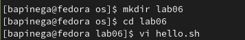{#fig:001 width=70%}
2. Нажму клавишу i 
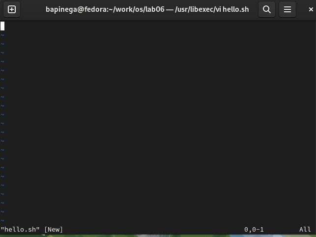{#fig:002 width=70%}
3. Введу текст:
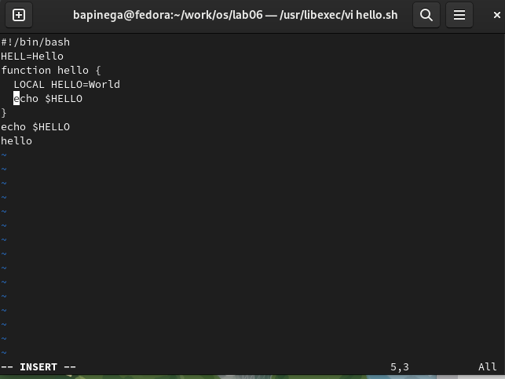{#fig:003 width=70%}
4. Нажму клавишу Esc для перехода в командный режим после завершения ввода
текста. Нажму : для перехода в режим последней строки:
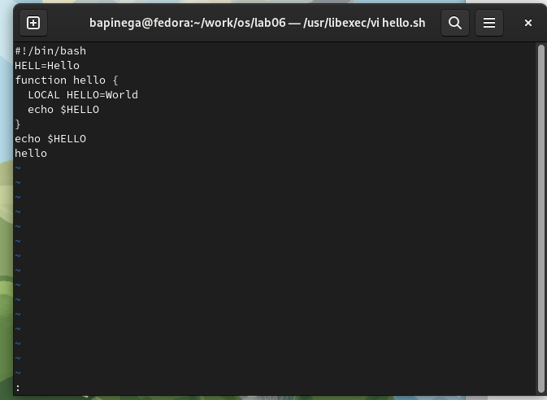{#fig:004 width=70%}
Нажму w (записать) и q (выйти), а затем нажму клавишу Enter для сохранения
текста и завершения работы.
5. Сделаю файл исполняемым:
{#fig:005 width=70%}
6. Вызову vi на редактирование файла:
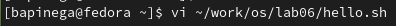{#fig:006 width=70%}
7. Установлю курсор в конец слова HELL и заменю его на HELLO. Нажму Esc для возврата в командный режим:
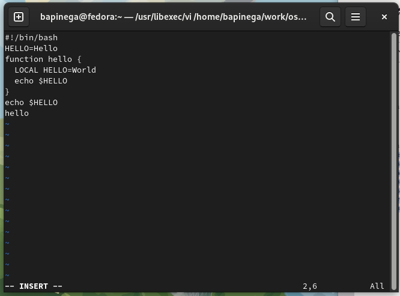{#fig:007 width=70%}
8. Сотру слово LOCAL и наберу local:
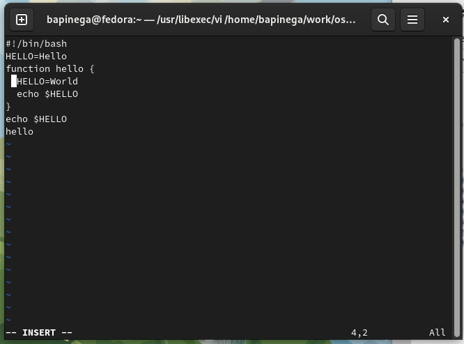{#fig:008 width=70%}
{#fig:009 width=70%}
9. Нажму Esc для возврата в командный режим:
{#fig:010 width=70%}
10. На последней строке вставлю текст: echo $HELLO:
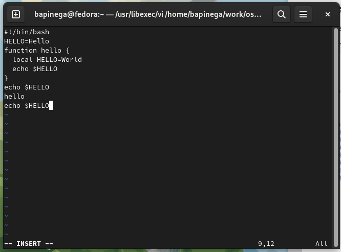{#fig:011 width=70%}
11. Нажму Esc для возврата в командный режим:
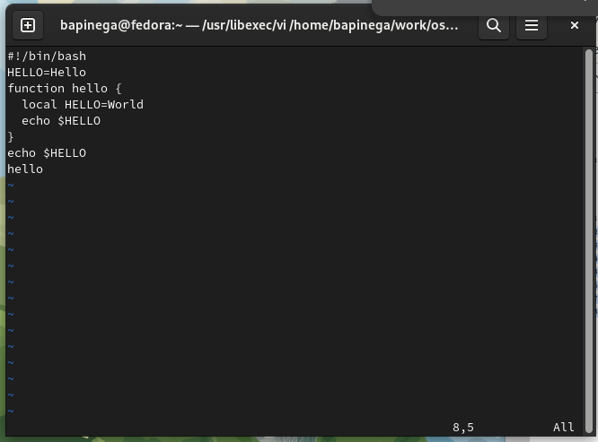{#fig:012 width=70%}
12. Удалю последнюю строку. ВВеду команду отмены изменений u для отмены последней команды:
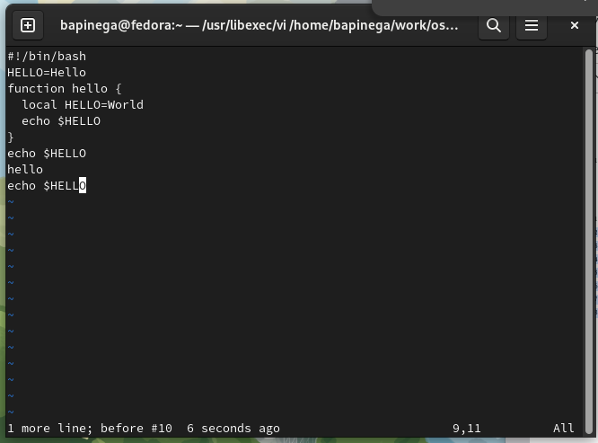{#fig:013 width=70%}
13. Введу символ : для перехода в режим последней строки. Запишу произведённые изменения и выйду из vi.
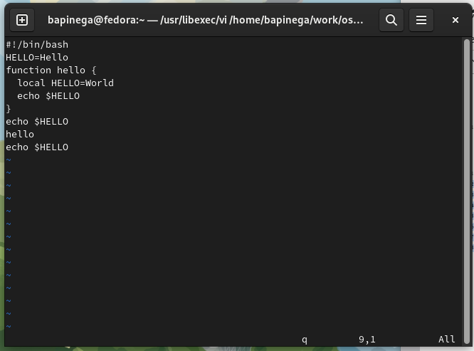{#fig:014 width=70%}

# Выводы

Я познакомилась с операционной системой Linux. Получила практические навыки работы с редактором vi, установленным по умолчанию практически во всех дистрибутивах.

# Список литературы{.unnumbered}

::: {#refs}
:::
