---
## Front matter
lang: ru-RU
title: Лабораторная работа 9
subtitle: Операционные системы
author:
  - Пинега Б.А.
institute:
  - Российский университет дружбы народов, Москва, Россия

## i18n babel
babel-lang: russian
babel-otherlangs: english

## Formatting pdf
toc: false
toc-title: Содержание
slide_level: 2
aspectratio: 169
section-titles: true
theme: metropolis
header-includes:
 - \metroset{progressbar=frametitle,sectionpage=progressbar,numbering=fraction}
 - '\makeatletter'
 - '\beamer@ignorenonframefalse'
 - '\makeatother'
---

# Информация

## Докладчик

:::::::::::::: {.columns align=center}
::: {.column width="70%"}

  * Пинега Белла Александровна
  * Студентка НБИбд-02-22
  * Российский университет дружбы народов

:::
::::::::::::::

## Цель работы

Познакомиться с операционной системой Linux. Получить практические навыки работы с редактором Emacs.

## Создам файл 
lab07.sh с помощью комбинации Ctrl-x Ctrl-f (C-x C-f).
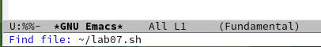{#fig:002 width=70%}

##  Сохраню файл 
с помощью комбинации Ctrl-x Ctrl-s (C-x C-s). Вырежу одной командой целую строку (С-k).
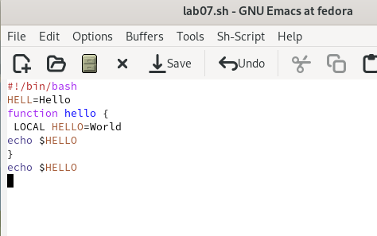{#fig:004 width=70%}

##  Вставлю эту строку 
в конец файла (C-y).
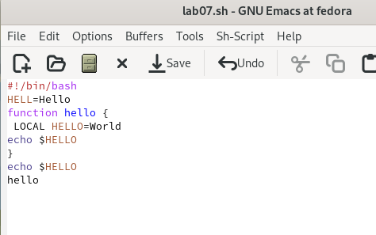{#fig:005 width=70%}

#3  Выделю область текста 
(C-space).
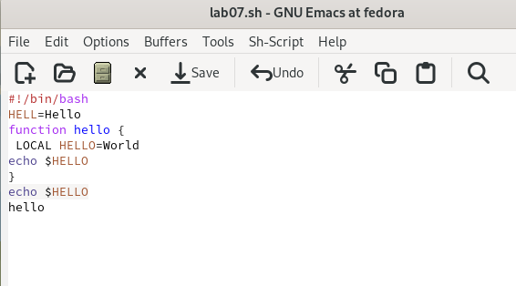{#fig:007 width=70%}

## Скопирую область 
в буфер обмена (M-w). Вставлю область в конец файла.
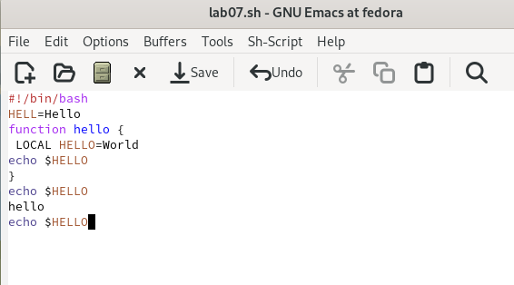{#fig:008 width=70%}

## .
 Вновь выделю эту область и на этот раз вырежу её (C-w).
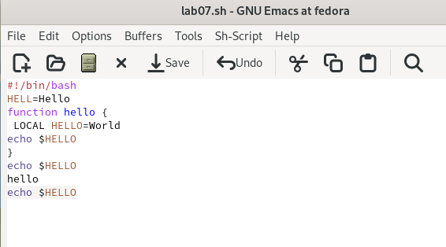{#fig:009 width=40%}
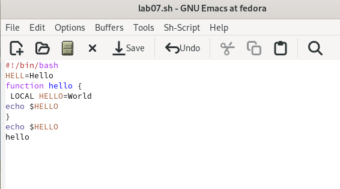{#fig:010 width=40%}

##  Отменю последнее действие 
(C-/).
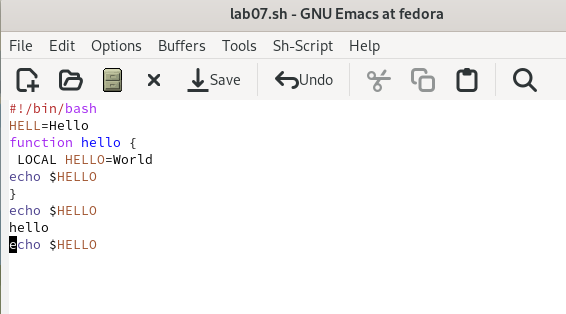{#fig:011 width=70%}

##  Перемещу курсор в начало строки 
(C-a).
{#fig:012 width=70%}

##  Перемещу курсор в конец строки 
(C-e).
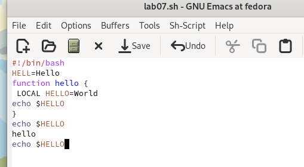{#fig:013 width=70%}

##  Перемещу курсор в начало буфера 
(M-<).
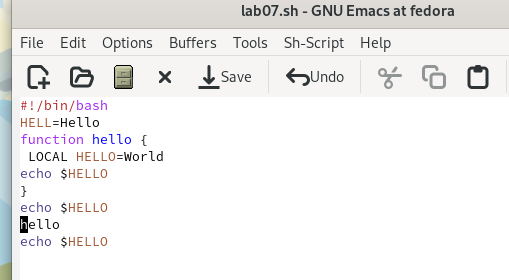{#fig:014 width=70%}

##  Перемещу курсор в конец буфера
 (M->).
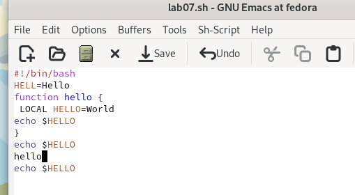{#fig:015 width=70%}

##  Выведу список активных буферов на экран 
(C-x C-b).
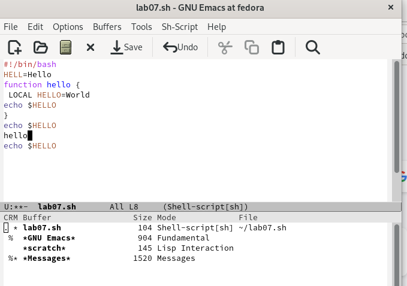{#fig:016 width=70%}

##  Закрою это окно
 (C-x 0).
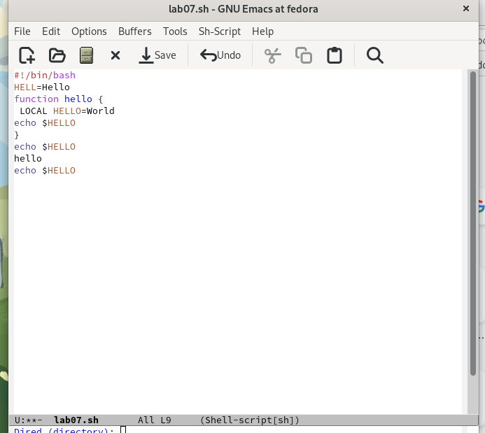{#fig:017 width=70%}

##  Поделю фрейм на 4 части: 
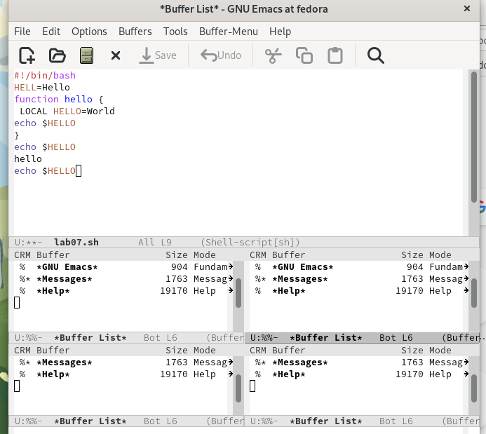{#fig:018 width=70%}

##  Переключусь в режим поиска 
(C-s) и найду несколько слов, присутствующих в тексте.
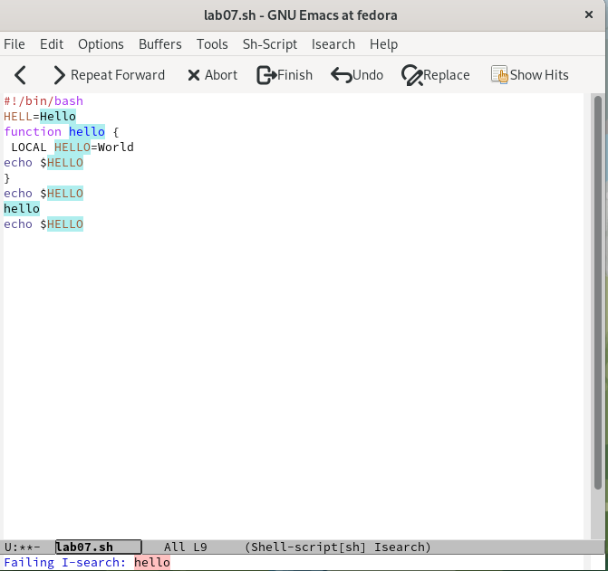{#fig:021 width=70%}

##  Перейду в режим поиска и замены
 (M-%)
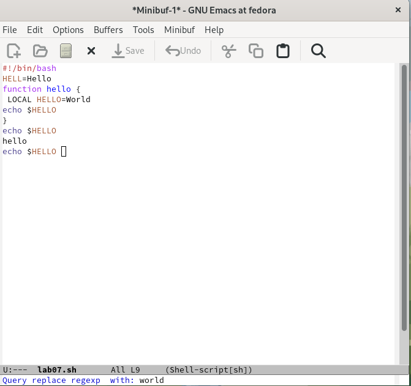{#fig:026 width=70%}

## Выводы
Я познакомилась с операционной системой Linux. Получила практические навыки работы с редактором Emacs.
