---
## Front matter
title: "Лабораторная работа №9"
subtitle: "Операционные системы"
author: "Пинега Белла Александровна"

## Generic otions
lang: ru-RU
toc-title: "Содержание"

## Bibliography
bibliography: bib/cite.bib
csl: pandoc/csl/gost-r-7-0-5-2008-numeric.csl

## Pdf output format
toc: true # Table of contents
toc-depth: 2
lof: true # List of figures
lot: true # List of tables
fontsize: 12pt
linestretch: 1.5
papersize: a4
documentclass: scrreprt
## I18n polyglossia
polyglossia-lang:
  name: russian
  options:
	- spelling=modern
	- babelshorthands=true
polyglossia-otherlangs:
  name: english
## I18n babel
babel-lang: russian
babel-otherlangs: english
## Fonts
mainfont: PT Serif
romanfont: PT Serif
sansfont: PT Sans
monofont: PT Mono
mainfontoptions: Ligatures=TeX
romanfontoptions: Ligatures=TeX
sansfontoptions: Ligatures=TeX,Scale=MatchLowercase
monofontoptions: Scale=MatchLowercase,Scale=0.9
## Biblatex
biblatex: true
biblio-style: "gost-numeric"
biblatexoptions:
  - parentracker=true
  - backend=biber
  - hyperref=auto
  - language=auto
  - autolang=other*
  - citestyle=gost-numeric
## Pandoc-crossref LaTeX customization
figureTitle: "Рис."
tableTitle: "Таблица"
listingTitle: "Листинг"
lofTitle: "Список иллюстраций"
lotTitle: "Список таблиц"
lolTitle: "Листинги"
## Misc options
indent: true
header-includes:
  - \usepackage{indentfirst}
  - \usepackage{float} # keep figures where there are in the text
  - \floatplacement{figure}{H} # keep figures where there are in the text
---

# Цель работы

Познакомиться с операционной системой Linux. Получить практические навыки работы с редактором Emacs.

# Задание

1. Ознакомиться с теоретическим материалом.
2. Ознакомиться с редактором emacs.
3. Выполнить упражнения.
4. Ответить на контрольные вопросы.

# Теоретическое введение

Emacs представляет собой мощный экранный редактор текста, написанный на языке
высокого уровня Elisp.

# Выполнение лабораторной работы
1. Открою emacs.
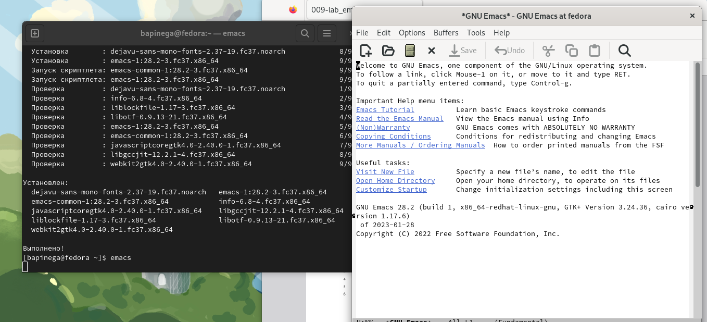{#fig:001 width=70%}
2. Создам файл lab07.sh с помощью комбинации Ctrl-x Ctrl-f (C-x C-f).
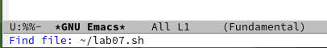{#fig:002 width=70%}
3. Наберу текст
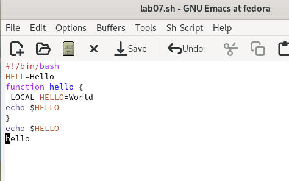{#fig:003 width=70%}
4. Сохраню файл с помощью комбинации Ctrl-x Ctrl-s (C-x C-s). Вырежу одной командой целую строку (С-k).
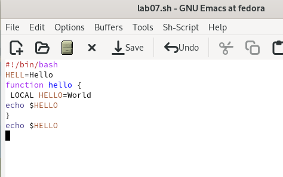{#fig:004 width=70%}
5.2. Вставлю эту строку в конец файла (C-y).
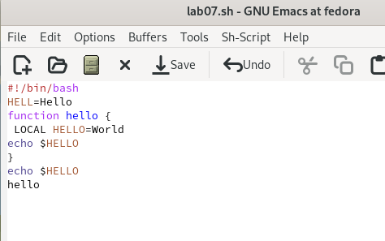{#fig:005 width=70%}
5.3. Выделю область текста (C-space).
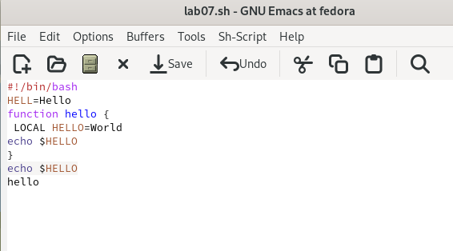{#fig:007 width=70%}
5.4. Скопирую область в буфер обмена (M-w). Вставлю область в конец файла.
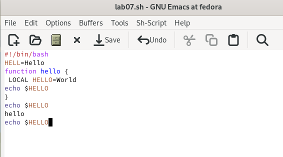{#fig:008 width=70%}
5.6. Вновь выделю эту область и на этот раз вырежу её (C-w).
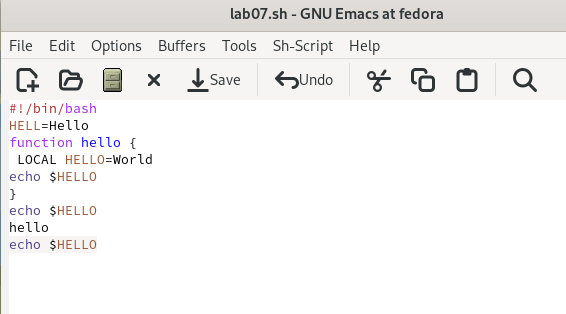{#fig:009 width=70%}
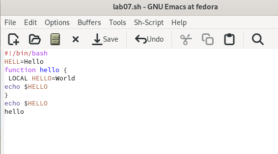{#fig:010 width=70%}
5.7. Отменю последнее действие (C-/).
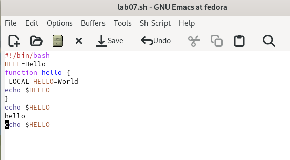{#fig:011 width=70%}
6.1. Перемещу курсор в начало строки (C-a).
{#fig:012 width=70%}
6.2. Перемещу курсор в конец строки (C-e).
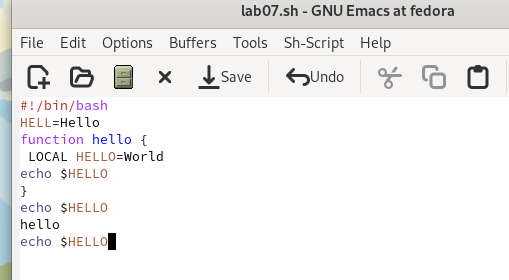{#fig:013 width=70%}
6.3. Перемещу курсор в начало буфера (M-<).
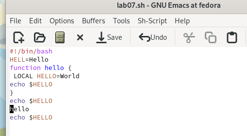{#fig:014 width=70%}
6.4. Перемещу курсор в конец буфера (M->).
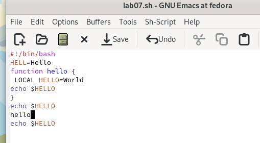{#fig:015 width=70%}
7.1. Выведу список активных буферов на экран (C-x C-b).
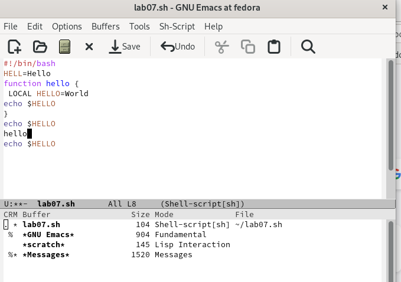{#fig:016 width=70%}
7.2. Закрою это окно (C-x 0).
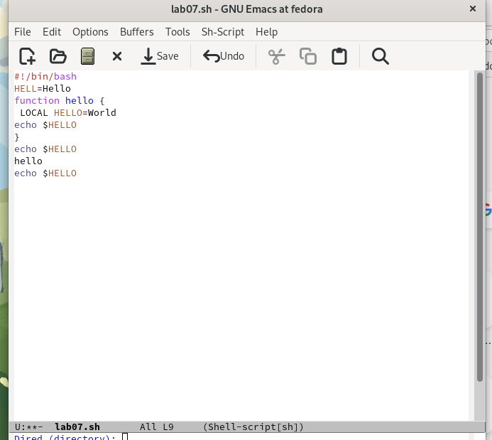{#fig:017 width=70%}
8.1. Поделю фрейм на 4 части: 
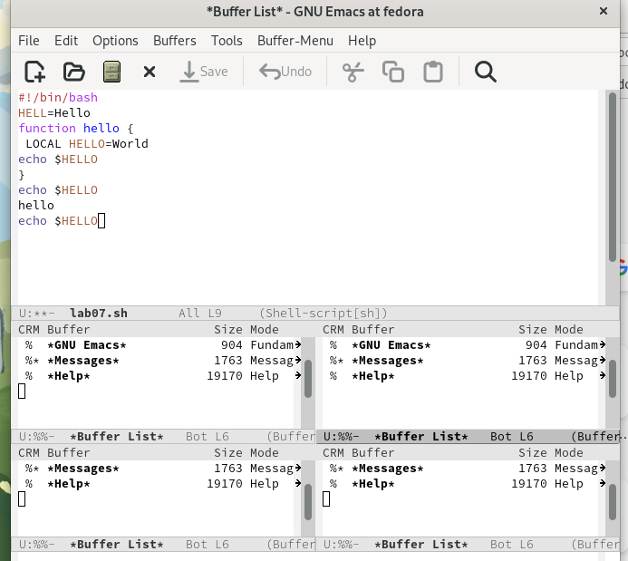{#fig:018 width=70%}
8.2. В каждом из четырёх созданных окон открою новый буфер (файл) и введу
несколько строк текста.
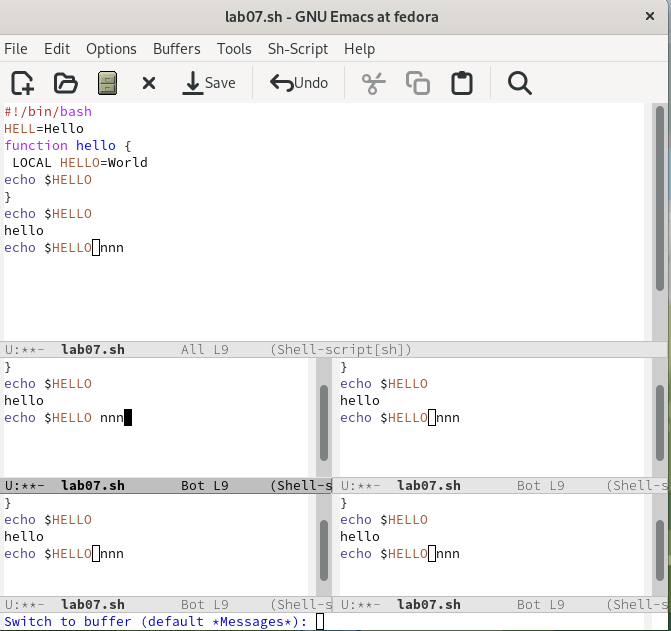{#fig:019 width=70%}
9.1. Переключусь в режим поиска (C-s) и найду несколько слов, присутствующих
в тексте.
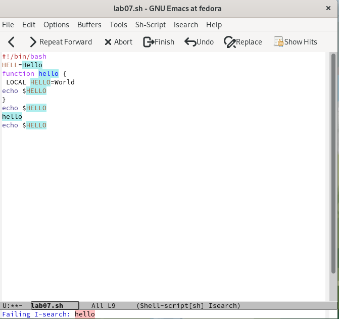{#fig:021 width=70%}
9.2. Переключаюсь между результатами поиска, нажимая C-s.
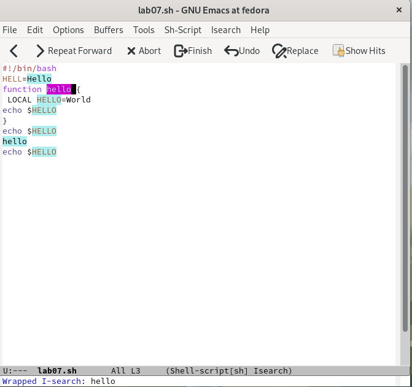{#fig:022 width=70%}
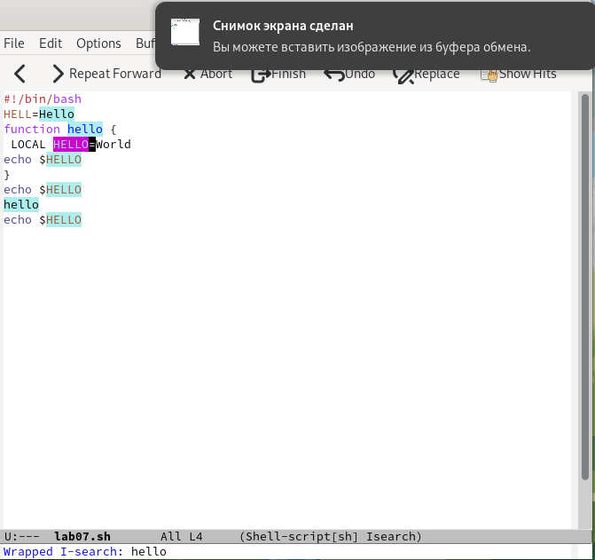{#fig:023 width=70%}
9.3. Выйду из режима поиска, нажав C-g.
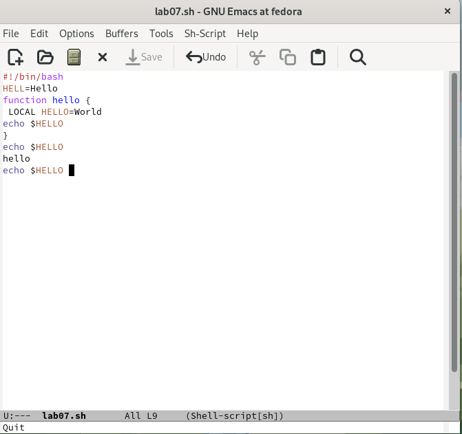{#fig:024 width=70%}
9.4. Перейду в режим поиска и замены (M-%)
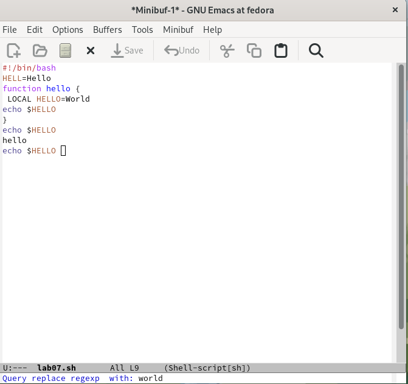{#fig:026 width=70%}
9.5. Испробую другой режим поиска, нажав M-s o
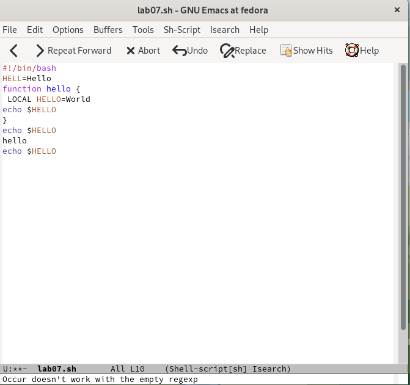{#fig:028 width=70%}
Разница в том что при поиске указывает номера строк в которых введенное слово выделяется цветом.

# Выводы

Я познакомилась с операционной системой Linux. Получила практические навыки работы с редактором Emacs.

# Список литературы{.unnumbered}

::: {#refs}
:::
