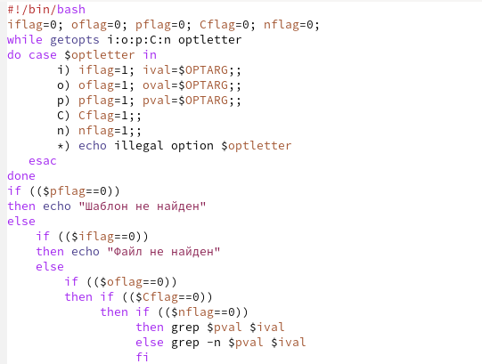
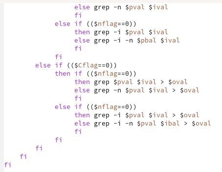
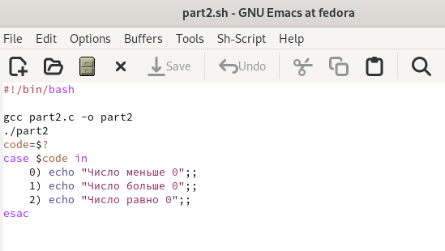
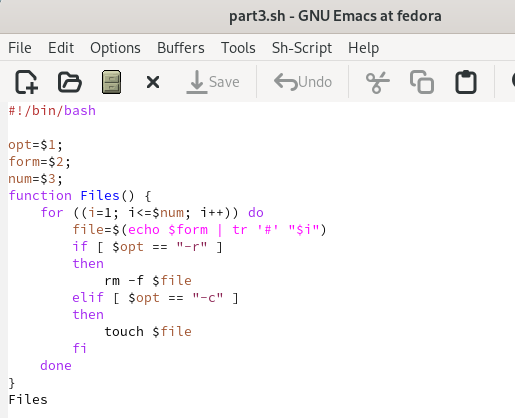
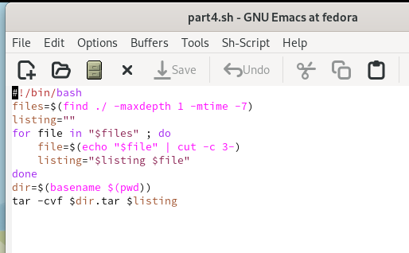

---
## Front matter
lang: ru-RU
title: Лабораторная работа 11
subtitle: Программирование в командном процессоре ОС UNIX. Ветвления и циклы.
author:
  - Пинега Б.А.
institute:
  - Российский университет дружбы народов, Москва, Россия

## i18n babel
babel-lang: russian
babel-otherlangs: english

## Formatting pdf
toc: false
toc-title: Содержание
slide_level: 2
aspectratio: 169
section-titles: true
theme: metropolis
header-includes:
 - \metroset{progressbar=frametitle,sectionpage=progressbar,numbering=fraction}
 - '\makeatletter'
 - '\beamer@ignorenonframefalse'
 - '\makeatother'
---

# Информация

## Докладчик

:::::::::::::: {.columns align=center}
::: {.column width="70%"}

  * Пинега Белла Александровна
  * Студентка НБИбд-02-22
  * Российский университет дружбы народов

:::
::::::::::::::

## Цель работы
Изучить основы программирования в оболочке ОС UNIX. Научится писать более
сложные командные файлы с использованием логических управляющих конструкций
и циклов.

## Задание 1
Написала командный файл, который анализирует командную строку с ключами
{#fig:001 width=40%}
{#fig:002 width=40%}

## Задание 2
Написала на языке Си программу, которая вводит число и определяет, является ли оно
больше нуля, меньше нуля или равно нулю.
{#fig:003 width=70%}

## Задание 3
Написала командный файл, создающий указанное число файлов, пронумерованных
последовательно от 1 до 𝑁
{#fig:004 width=70%}

## Задание 4
Написала командный файл, который с помощью команды tar запаковывает в архив все файлы в указанной директории
{#fig:005 width=70%}

## Выводы
Я изучила основы программирования в оболочке ОС UNIX. Научилась писать более
сложные командные файлы с использованием логических управляющих конструкций
и циклов.
