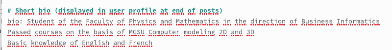
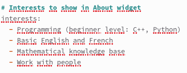
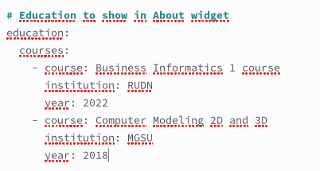
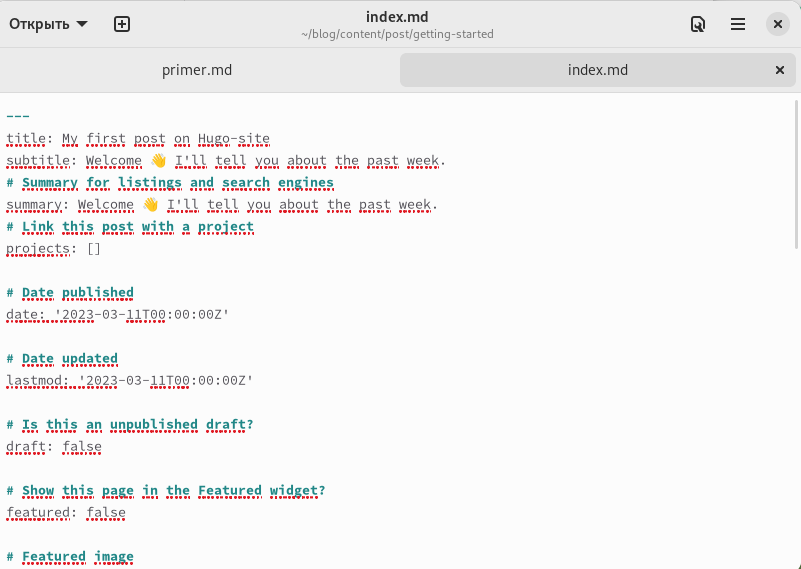
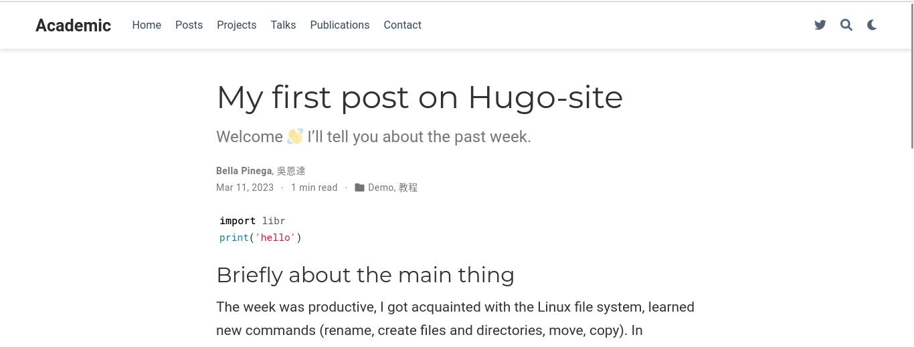
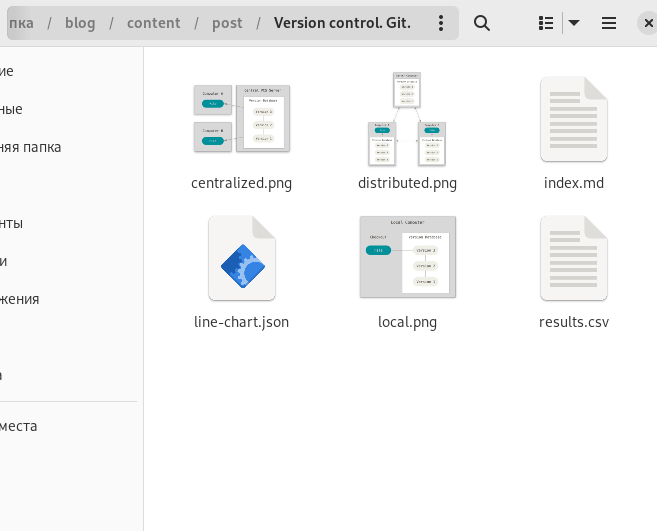
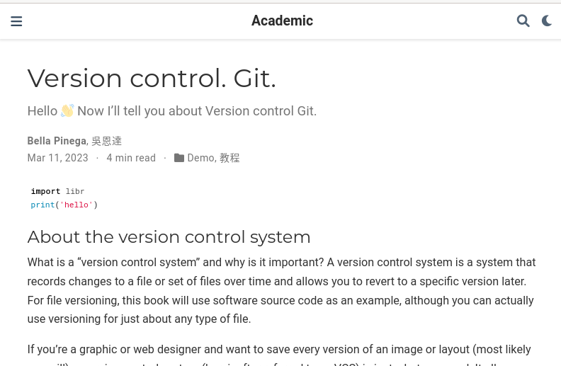
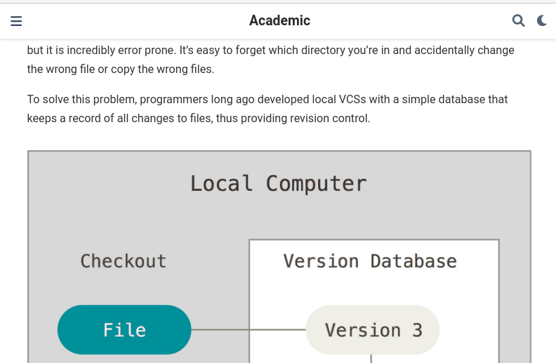

---
## Front matter
lang: ru-RU
title: Индивидуальный проект 2 этап
subtitle: Операционные системы
author:
  - Пинега Б.А.
institute:
  - Российский университет дружбы народов, Москва, Россия

## i18n babel
babel-lang: russian
babel-otherlangs: english

## Formatting pdf
toc: false
toc-title: Содержание
slide_level: 2
aspectratio: 169
section-titles: true
theme: metropolis
header-includes:
 - \metroset{progressbar=frametitle,sectionpage=progressbar,numbering=fraction}
 - '\makeatletter'
 - '\beamer@ignorenonframefalse'
 - '\makeatother'
---

# Информация

## Докладчик

:::::::::::::: {.columns align=center}
::: {.column width="70%"}

  * Пинега Белла Александровна
  * Студентка НБИбд-02-22
  * Российский университет дружбы народов

:::
::::::::::::::

## Цель

Добавить к сайту данные о себе.

:::
## Задание 1 
Добавляю фото 
{#fig:001 width=70%}

## Задание 2
Изменяю краткое описание 
{#fig:002 width=70%}

## Задание 3
Добавляю информацию об интересах
{#fig:003 width=70%}

## Задание 4
Добавляю информацию от образовании
{#fig:004 width=70%}

## Задание 5
Создаю пост по прошедшей неделе:
{#fig:005 width=40%}
{#fig:006 width=40%}

## Задание 6
В папке ~/blog/content/post создаю папку по теме на выбор по шаблону папки getting-started и проделываю аналогичные действия
{#fig:007 width=70%}

## Пост на тему Управление версиями. Git
{#fig:008 width=70%}
{#fig:009 width=70%}

## Вывод

Я добавила к сайту данные о себе.

::: 

