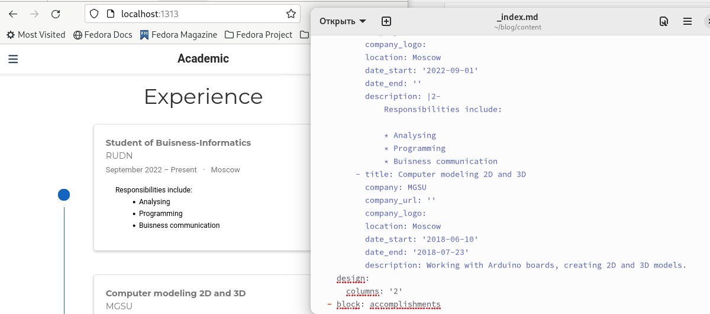

---
## Front matter
lang: ru-RU
title: Индивидуальный проект 3 этап
subtitle: Операционные системы
author:
  - Пинега Б.А.
institute:
  - Российский университет дружбы народов, Москва, Россия

## i18n babel
babel-lang: russian
babel-otherlangs: english

## Formatting pdf
toc: false
toc-title: Содержание
slide_level: 2
aspectratio: 169
section-titles: true
theme: metropolis
header-includes:
 - \metroset{progressbar=frametitle,sectionpage=progressbar,numbering=fraction}
 - '\makeatletter'
 - '\beamer@ignorenonframefalse'
 - '\makeatother'
---

# Информация

## Докладчик

:::::::::::::: {.columns align=center}
::: {.column width="70%"}

  * Пинега Белла Александровна
  * Студентка НБИбд-02-22
  * Российский университет дружбы народов

:::
::::::::::::::

## Цель

Добавить к сайту данные о себе.

## Добавляю информацию о навыках (Skills).
{#fig:001 width=70%}
## Добавляю информацию об опыте (Experience).
{#fig:002 width=70%}
## Добавляю информацию о достижениях (Accomplishments).
{#fig:003 width=70%}
## пост по прошедшей неделе:
{#fig:004 width=70%}
## пост на тему Язык разметки Markdown.
{#fig:005 width=70%}
## Выводы
Я добавила к сайту достижения.

