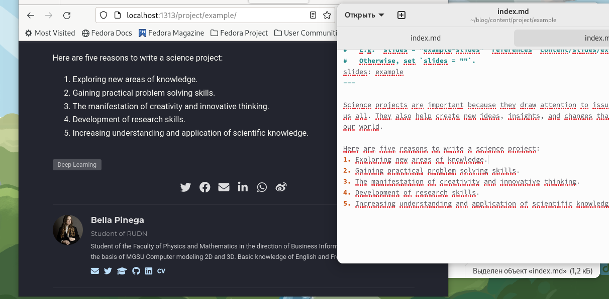
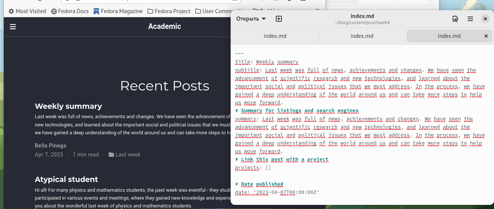
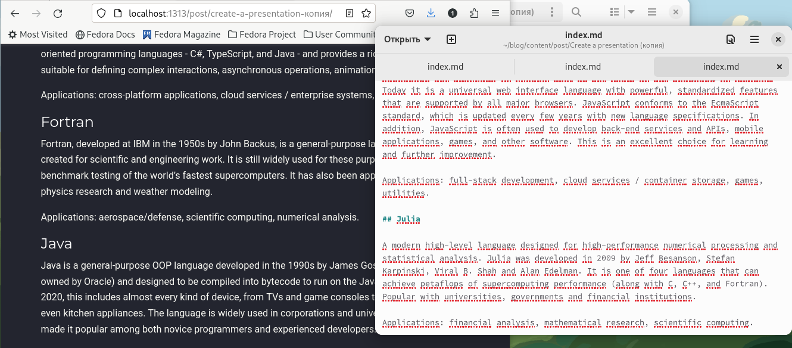

---
## Front matter
lang: ru-RU
title: Индивидуальный проект 5
subtitle: Операционные Системы
author:
  - Пинега Б.А.
institute:
  - Российский университет дружбы народов, Москва, Россия

## i18n babel
babel-lang: russian
babel-otherlangs: english

## Formatting pdf
toc: false
toc-title: Содержание
slide_level: 2
aspectratio: 169
section-titles: true
theme: metropolis
header-includes:
 - \metroset{progressbar=frametitle,sectionpage=progressbar,numbering=fraction}
 - '\makeatletter'
 - '\beamer@ignorenonframefalse'
 - '\makeatother'
---

# Информация

## Докладчик

:::::::::::::: {.columns align=center}
::: {.column width="70%"}

  * Пинега Белла Александровна
  * Студентка НБИбд-02-22
  * Российский университет дружбы народов

:::
::::::::::::::

## Цель
Добавить к сайту все остальные элементы.

## 1 задание
Сделаю записи для персональных проектов
{#fig:001 width=70%}

## 2 задание
Пост по прошедшей неделе
{#fig:002 width=70%}

## 3 задание
Добавлю пост на тему языки научного программирования
{#fig:003 width=70%}

## Вывод
Я добавила к сайту все остальные элементы.

